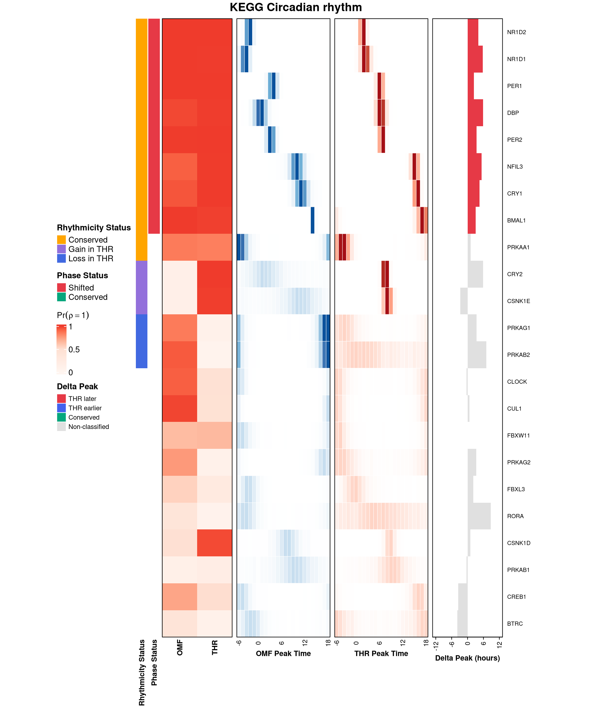

# BayRC

**Bayesian Rhythmicity Comparison** (BayRC) is a unified statistical framework for comparing and interpreting circadian rhythms across biological conditions: age, disease state, tissue, species, or sex.

BayRC jointly infers gene-level rhythmicity and phase, computes posterior probabilities of rhythmic and phase concordance, and classifies rhythmic gain, loss, conservation, and direction-specific phase shifts under Bayesian false discovery rate (BFDR) control. It further supports pathway-level enrichment and genome-wide concordance scoring, providing a unified, uncertainty-aware framework for comparative circadian analysis across tissues, species, and disease contexts.

---

## Biological Questions Answered

BayRC answers a multifaceted set of biological questions by moving through three
levels of resolution: the gene, the pathway, and the genome.

| Biological Question | Statistical Output |
|---|---|
| Which genes oscillate with a 24-hour rhythm? | Posterior P(rhythmic) + Bayes Factor per gene |
| How confident are we in the amplitude and peak timing? | Posterior estimates + 95% credible intervals (circular HDI for phase) |
| Which genes gained, lost, or conserved rhythmicity? | BFDR-controlled transition classification |
| Do conserved genes peak at the same time of day? | Circular phase concordance + 95% HDI of Δφ |
| Which biological pathways are remodeled? | Two-stage pathway enrichment + gain-loss ratio (GLR) |
| How similar are two transcriptomes globally? | Adjusted Jaccard c-score + permutation p-value + bootstrap CI |

---

## Installation

```r
install.packages(c("remotes", "BiocManager"))
options(repos = BiocManager::repositories())   # resolves the Bioconductor deps (KEGGREST, fgsea)
remotes::install_github("quythien/BayRC", upgrade = "never", build_vignettes = TRUE)
library(BayRC)
```

If you've cloned the repository and want to work on it locally:

```r
devtools::load_all("path/to/your/local/BayRC")
```

**Dependencies:** `Rcpp`, `circular`, `ggplot2`, `dplyr`  
**Suggested:** `ComplexHeatmap`, `KEGGREST`, `biomaRt`, `edgeR`, `DESeq2`, `parallel`

---

## Omental Fat vs. Thyroid: A Real Circadian Rewiring Story

Omental fat (OMF, a visceral adipose depot) and thyroid (THR) aren't
directly connected the way two brain nuclei might be, but thyroid hormone
is a master regulator of whole-body metabolic rate, so a real circadian
relationship between them is biologically plausible. This pair was found
by screening real posterior data across all 26 baboon tissues in the
underlying atlas for the pair with the strongest, most genuinely mixed
transition signal, rather than picked in advance: the search itself is
part of what BayRC is for.

The numbers below come from the manuscript's real production posterior
(2,001 iterations per condition), loaded from external files, not from
data bundled with the package: that posterior is too large to ship with
the package. Every number is still real output from running the current
package code, not a fabricated or illustrative example.

```r
# mcmc_OMF and mcmc_THR here are real production posteriors, loaded from
# external files (not bundled with the package). For a smaller version of
# this walkthrough you can run yourself end to end on bundled data, see
# inst/analysis/quickstart_baboon_OMF_THR.R: real and reproducible, at a
# shorter 2,500-iteration chain.

bf_OMF <- summarize_bay(mcmc_OMF$rho, BF = 3, p_rhythmic = 0.2)
head(bf_OMF[order(-bf_OMF$BayesF), c("RowAverage", "BayesF")], 5)
#         RowAverage BayesF
# ZNF207        1.00  4e+20
# LRRC40        1.00  4e+20
# MAPK6         1.00  4e+20
# TAX1BP1       1.00  4e+20
# STXBP3        1.00  4e+20   # all five: posterior support 1.0 in every
#                              # retained sample, BF unbounded as posterior -> 1

detected <- detect_rhy(mcmc_OMF, mcmc_THR, bfdr_alpha = 0.20)
# OMF rhythmic: 3,067 / 5,066   THR rhythmic: 3,461 / 5,066

pA <- rowMeans(mcmc_OMF$rho)
pB <- rowMeans(mcmc_THR$rho)
trans <- transition_classify(pA, pB, bfdr_alpha = 0.20)
# tau_gain = 0.659, n_gain = 512 | tau_loss = 0.694, n_loss = 330 | n_cons = 1498
# A genuinely mixed picture: substantial gain, substantial loss, and a
# large conserved set, not one category dominating the other two

phase <- phase_infer(phi_matrix1 = mcmc_OMF$phi, phi_matrix2 = mcmc_THR$phi,
                     gain_loss_status = trans$gain_loss_status,
                     shift = 2, P = 24, bfdr_alpha = 0.20, compute_hdi = TRUE)
# of the 1,498 conserved genes: 617 phase-conserved, 559 phase-shifted, 322 undetermined
# Close to an even split between conserved and shifted timing

kegg <- readRDS(system.file("extdata", "kegg_pathway_list_hsa.rds", package = "BayRC"))
result_union <- pathSelect(mcmc.merge.list = list(A = mcmc_OMF, B = mcmc_THR),
                           pathway.list = kegg, dataset.names = c("A", "B"),
                           ranking.method = "union", score_type = "pos",
                           qvalue.cut = 0.20, nperm = 500)
# 2 of 224 testable pathways pass the Stage 1 union pre-screen (pval < 0.05):
# the union test emphasizes the gain direction, which isn't where this
# pair's real signal is. Running the loss-specific and conserved-specific
# Stage 2 tests directly (ranking.method = "loss" / "conserved") finds it:

result_loss <- pathSelect(mcmc.merge.list = list(A = mcmc_OMF, B = mcmc_THR),
                          pathway.list = kegg, dataset.names = c("A", "B"),
                          ranking.method = "loss", score_type = "pos",
                          qvalue.cut = 0.20, nperm = 500)
# 55 of 224 pathways reach Stage 2 significance (padj/Q < 0.20) for loss,
# including KEGG Circadian rhythm (Q = 0.021) and KEGG Circadian
# entrainment (Q = 0.022) -- real circadian-clock-specific KEGG pathways
# showing significant loss of rhythmicity between these two tissues

global <- multi_conservation(mcmc.merge.list = list(A = mcmc_OMF, B = mcmc_THR),
                             dataset.names = c("A", "B"),
                             select.pathway.list = "global",
                             n_perm = 200, n_boot = 200, use_cpp = TRUE,
                             save_output = FALSE)
# AdjustedConcordance = 0.094 (95% CI 0.084-0.105), p = 0.005 -- significant;
# GainLossRatio = 1.135 (near-balanced, slightly gain-leaning)
```

## How BayRC Categorizes Every Gene

Every gene ends up in exactly one category at each stage, all under Bayesian
FDR control at the same alpha, no gene left unclassified. Real counts from
the run above (5,066 genes, BFDR α = 0.20):

**Single-group detection** (before the two tissues are ever compared):

| Condition | Genes tested | Rhythmic (BFDR-controlled) |
|---|---|---|
| OMF | 5,066 | 3,067 |
| THR | 5,066 | 3,461 |

**Two-group comparison** (OMF vs. THR jointly):

| Category | Genes | What it means |
|---|---|---|
| Conserved | 1,498 | Rhythmic in both tissues, confidently |
| Gain in THR | 512 | Rhythmic in THR only |
| Loss in THR | 330 | Rhythmic in OMF only |
| Non-rhythmic | 2,726 | Neither tissue clears the threshold |

Unlike a tissue pair dominated by one category, this one shows real
representation in all three: substantial gain, substantial loss, and the
largest classified category still being conservation.

**Within the 1,498 conserved genes**, a further BFDR-controlled call on peak timing:

| Phase category | Genes |
|---|---|
| Phase-conserved | 617 |
| Phase-shifted | 559 |
| Undetermined | 322 |

Close to an even split between genes that keep their peak timing and
genes whose timing shifts, with a meaningful undetermined band. The phase
call is a second, independent BFDR-controlled decision layered on top of
the conserved-rhythm call, so at this stricter alpha a larger share of
genes clear the bar for "rhythmic in both tissues" without also clearing
the bar for a confident phase-shift verdict.

---

## Rhythmic Biomarker Summary

"How many rhythmic biomarkers do I have?" doesn't have one universal
answer: it depends on how strict a call you're willing to make. BayRC
supports two different criteria, and it's worth seeing them side by side
on the same OMF/THR posteriors used above.

```r
bf_OMF <- summarize_bay(mcmc_OMF$rho, BF = 3, p_rhythmic = 0.2)
bf_THR <- summarize_bay(mcmc_THR$rho, BF = 3, p_rhythmic = 0.2)

sum(bf_OMF$BayesF >= 3, na.rm = TRUE)   # 3,122 of 5,066: "positive" evidence (Kass & Raftery 1995)
sum(bf_OMF$BayesF >= 10, na.rm = TRUE)  # 2,128 of 5,066: "strong" evidence, same scale

d <- detect_rhy(mcmc_OMF, mcmc_THR, bfdr_alpha = 0.20)
d$n_rhythmic_A  # 3,067 of 5,066
```

| Criterion | OMF rhythmic | THR rhythmic | What it controls |
|---|---|---|---|
| Bayes Factor ≥ 3 ("positive" evidence) | 3,122 / 5,066 | 3,099 / 5,066 | Per-gene evidence strength; no correction for testing thousands of genes at once |
| Bayes Factor ≥ 10 ("strong" evidence) | 2,128 / 5,066 | 2,412 / 5,066 | Same, at a stricter per-gene bar |
| BFDR-controlled, α = 0.20 | 3,067 / 5,066 | 3,461 / 5,066 | Expected false discovery rate across the whole gene set |

A raw Bayes Factor cutoff is a per-gene evidence threshold: it says
nothing about how many false positives to expect once you're scanning
thousands of genes at once. BFDR control answers that question directly,
which is why it's the default criterion for every gain/loss/conservation
call elsewhere in this walkthrough. The two criteria don't have to agree
gene-for-gene, and here they don't fully: they're answering related but
distinct questions, evidence strength for one gene versus expected error
rate across all of them, so treat a BF-based count as a quick per-gene
screen and a BFDR-based count as the one to report as a calibrated
biomarker list.

---

## Checking Convergence

Every number above assumes the MCMC chain actually converged and mixed
well. BayRC checks this with `mcmc_diagnostics()`, which runs
automatically (`diagnostics = TRUE` by default in
`CB_MCMC_single_rj_slice()`) and can also be called later on any saved
result, since the underlying `rho`, `phi`, and `if.accept.rj` matrices are
always stored regardless of that flag:

```r
diag_OMF <- mcmc_diagnostics(mcmc_OMF)
```

ESS for phi needs a word of caution: it isn't simply "higher is better."
A gene with a diffuse, unconfident phase posterior can show artificially
*high* ESS, because each draw is close to independent of the last when
there's little real signal to get stuck on. A gene with a tight,
confident posterior can show *low* ESS if the sampler moves in small
steps within that narrow region from iteration to iteration, even though
the estimate itself is trustworthy. Read ESS for phi alongside the
posterior rhythmicity probability for that gene, not on its own.

---

## The BayRC Pathway Heatmap

A key deliverable of BayRC is an integrated pathway heatmap (Figure 5 in the manuscript) that reads **across six panels from left to right** for each gene in a pathway of interest:

| Panel | Shows | How to read it |
|---|---|---|
| 1. Rhythmicity status | Transition type (what happened biologically) | Orange = conserved rhythm, purple = gain in condition B, blue = loss in B |
| 2. Phase status | Whether peak timing shifted, for conserved genes only | Green = conserved (peaks align within the tolerance), red = shifted (the clock resets) |
| 3. P(ρ=1 \| data), A and B | Posterior probability of oscillation in each condition | White to red gradient, 0 to 1; deep red = confident rhythmic, near white = flat |
| 4. Phase posterior, condition A | MCMC posterior distribution of peak time (ZT −6 to 18) | A sharp bar means confident peak timing; a spread-out bar means high phase uncertainty |
| 5. Phase posterior, condition B | Same as panel 4, for condition B | Compare bar position against panel 4 to see the shift visually |
| 6. Delta peak (hours) | Signed peak-time difference, B minus A | Positive = B peaks later; negative = B peaks earlier; gray = not classified (gain, loss, or undetermined phase) |

This design lets you read the entire circadian landscape of a pathway (which genes oscillate, when they peak, and whether that timing is preserved) in a single glance.

`plot_heatmap()` builds this figure from `transition_classify()` and
`phase_infer()` output. Two real examples below, both from the same
OMF-vs-THR posterior above, both real Stage 2 loss-significant KEGG
pathways (padj < 0.20 among 224 testable):

**KEGG Long-term depression** (padj = 0.0018, the strongest statistical
hit) has the most balanced gene-level mix of the two: of 19 matched
genes, 4 gain in THR, 5 loss in THR, 6 maintained, 4 non-rhythmic. Every
transition type is genuinely represented, not just the dominant one.


**KEGG Circadian rhythm** (padj = 0.12, weaker statistically but the
clearest possible thematic fit) contains the core molecular clock genes
themselves: `NR1D1`, `NR1D2`, `PER1`, `PER2`, `CRY1`, `BMAL1`, `CLOCK`,
`CSNK1D`, `CSNK1E`. Of 23 matched genes, 2 gain in THR, 2 loss in THR, 9
maintained, 10 non-rhythmic; among the maintained genes, most show THR
peaking later than OMF.



---

## Key Functions

BayRC exports 22 functions, grouped below the same way the paper's Methods
section is organized (§2.1 through §2.4).

### 1. MCMC Core (paper §2.1)
| Function | Purpose |
|---|---|
| `CB_init_single()` | Initialize MCMC chain from cosinor fit or random draws |
| `CBt_init_single()` | Initialization for the pipeline's time-error-aware variant |
| `CB_MCMC_single_rj_slice()` | Core Reversible Jump MCMC sampler, the main engine |
| `CB_getAllEst()` | Posterior point estimates + 95% credible intervals; uses `circular_HDI()` for phase |
| `mcmc_diagnostics()` | Convergence diagnostics (RJMCMC acceptance rate, ESS for rho and phi); runs automatically (`diagnostics = TRUE` by default) or can be called later on any saved MCMC result |
| `CBt_sim_data()` | Simulate circadian data for testing and tutorials |
| `Cosinor_fit()` | Classical OLS cosinor fit, the non-Bayesian baseline the paper contrasts BayRC with |
| `circular_HDI()` | Shortest-arc 95% credible interval for a phase posterior |
| `circular_median()` | Circular median of a phase posterior |

`circular_HDI()` matters because phase is periodic: a gene peaking near ZT23
and one peaking near ZT01 are one hour apart, not 22. A naive linear
credible interval would miss that. The panel below shows real posterior
phase distributions for four genes in baboon omental fat, all with
posterior P(rhythmic) > 0.9, from the same real production posterior
used throughout the walkthrough above. `BMAL1` and `NR1D1`, both core
clock genes, show an HDI that sits entirely within one day; `DBP` (also a
core clock gene) and `FAM76B` show the arc correctly wrapping through
ZT0/ZT24, which is exactly the case a linear interval gets wrong. All
four genes were chosen for high confidence (posterior rhythmicity > 0.7)
so the wrapping behavior reflects real signal, not sampling noise from a
weakly-rhythmic gene.


### 2. Gene-Level Biomarker Detection with BFDR Control (paper §2.2)

> **Workflow position:** `match_symbols()` runs once per condition immediately
> after MCMC and before any downstream analysis. Skipping it causes silent
> failures further down the pipeline.

**Single-group** (one condition's MCMC output at a time):

| Function | Purpose |
|---|---|
| `match_symbols()` | Annotate MCMC output with gene symbols; required before classification |
| `bfdr_from_posterior()` | BFDR threshold τ from a vector of posterior probabilities (paper Eq. 2) |
| `summarize_bay()` | Per-gene Bayes Factor: `BF = posterior_odds / prior_odds` |

**Two-group** (comparing two conditions jointly):

| Function | Purpose |
|---|---|
| `detect_rhy()` | Condition-specific rhythmic gene sets with BFDR control, one condition against the other |
| `transition_classify()` | Joint posterior BFDR for gain / loss / conservation |
| `phase_infer()` | Phase-shift vs. conservation classification + 95% circular HDI on Δφ |

### 3. Pathway-Level Rhythmic Enrichment and Directionality (paper §2.3)
| Function | Purpose |
|---|---|
| `pathSelect()` | Stage 1: `ranking.method="union"` (active pathways); Stage 2: `"gain"`, `"loss"`, `"conserved"` — one function, all stages |
| `plot_heatmap()` | The six-panel pathway heatmap described above (Figure 5 in the manuscript) |
| `multi_conservation_pathway()` | Pathway-level concordance score for a chosen gene set |
| `multi_conservation_pathway_bootstrap()` | Pathway-level concordance with bootstrap confidence intervals |

### 4. Genome-Wide Concordance Summary (paper §2.4)
| Function | Purpose |
|---|---|
| `multi_conservation()` | Full pipeline: c-score + GLR + permutation p-value + bootstrap CI |

### 5. Cross-Species Alignment

Needed only when comparing across species (e.g. the baboon-human lung
comparison in the manuscript); skip for same-species comparisons.

| Function | When to use | What it does |
|---|---|---|
| `match_homologs()` | Automated, needs internet | Uses biomaRt to find 1:1 orthologs; aligns all datasets to reference gene space |
| `merge_mcmc()` | Reproducible, needs a pre-built ortholog table | Alternative to `match_homologs()` using an explicit ortholog database; more reproducible than live biomaRt queries |

---

## Glossary

**Posterior probability.** After seeing the data, how likely a claim is, on a
scale from 0 to 1. In BayRC, P(rhythmic | data) is the posterior probability
that a gene actually oscillates on a 24-hour cycle, combining the prior
assumption with what the expression data show (paper §2.1, spike-and-slab
model).

**Bayes factor.** How much more the data support "this gene is rhythmic"
over "this gene is not," expressed as a ratio: BF = posterior odds / prior
odds. A Bayes factor of 3 means the data are 3 times more consistent with
rhythmicity than with no rhythm; higher is stronger evidence. `summarize_bay()`
computes this per gene.

**Credible interval.** The Bayesian counterpart to a confidence interval: a
range with a stated probability (usually 95%) of containing the true value,
given the data. For phase, this is computed on a circle rather than a line
(the circular highest density interval, or circular HDI; paper Supplementary
Algorithm 1), since 23:00 and 01:00 are close together, not 22 hours apart.

**Bayesian false discovery rate (BFDR).** The expected fraction of "rhythmic"
or "gained/lost/conserved" calls that are actually false positives, computed
directly from posterior probabilities rather than from p-values (Newton et al.
2004, *Biostatistics*; Müller, Parmigiani & Rice 2007, *Bayesian Statistics 8*;
Scott & Berger 2010, *Annals of Statistics*; Stephens 2016, *Biostatistics*).
BayRC picks a decision threshold so this expected fraction stays under a
chosen level (0.20 in most examples here; paper §2.2, Eq. 2), then calls
every gene that clears it.

**Circular / phase concordance.** Whether two conditions peak at the same
time of day. Because time of day wraps around every 24 hours, phase
differences have to be measured on a circle: a gene peaking at 23:00 in one
condition and 01:00 in the other is 2 hours off, not 22 (paper §2.2, part 3).

**Gain / loss / conservation.** The three ways a gene's rhythm can change
between two conditions: it can start oscillating where it didn't before
(gain), stop oscillating (loss), or keep oscillating in both (conserved).
`transition_classify()` makes this call under BFDR control (paper §2.2,
part 2).

**Genome-wide concordance (c-score).** A single number summarizing how
similar two conditions' rhythmic programs are overall, built by averaging an
adjusted Jaccard index across MCMC iterations so it propagates posterior
uncertainty rather than relying on one fixed gene list (paper §2.4, Eq. 5;
related to the congruence framework of
[Zong et al. 2023](https://doi.org/10.1073/pnas.2202584120)). Centered at 0
(no more overlap than chance) with 1 meaning perfect agreement.
`multi_conservation()` computes it along with a permutation p-value and
bootstrap confidence interval.

### References

- Mure LS, Le HD, Benegiamo G, et al. Diurnal transcriptome atlas of a primate
  across major neural and peripheral tissues. *Science*. 2018;359(6381):eaao0318.
  [10.1126/science.aao0318](https://doi.org/10.1126/science.aao0318)
- Newton MA, Noueiry A, Sarkar D, Ahlquist P. Detecting differential gene
  expression with a semiparametric hierarchical mixture method.
  *Biostatistics*. 2004;5(2):155-176.
- Müller P, Parmigiani G, Rice K. FDR and Bayesian multiple comparisons rules.
  *Bayesian Statistics 8*. 2007:349-370.
- Scott JG, Berger JO. Bayes and empirical-Bayes multiplicity adjustment in
  the variable-selection problem. *Annals of Statistics*. 2010;38(5):2587-2619.
- Stephens M. False discovery rates: a new deal. *Biostatistics*.
  2016;18(2):275-294.
- Zong W, Rahman T, Zhu L, et al. Transcriptomic congruence analysis for
  evaluating model organisms. *PNAS*. 2023;120(6):e2202584120.
  [10.1073/pnas.2202584120](https://doi.org/10.1073/pnas.2202584120)

---

## Reproducing the Manuscript Figures

Each figure in the paper is generated by a specific script in `inst/analysis/`.
The table below summarizes the mapping; see `inst/analysis/README_figures.md` for
full details on inputs and parameters.

| Figure | Description | Generating script |
|---|---|---|
| 1 | Framework overview flowchart | none (created externally as an illustration) |
| 2 | Genome-wide concordance heatmaps across 26 baboon tissues | `circa_concordance.plots.R` |
| 3 | Within-species phase concordance scatter (SCN-HIP and SUN-PUT) | `Baboon_SCN_HIP.R`, `Baboon_SUN_PUT.R` |
| 4 | SUN-PUT pathway enrichment dotplots | `Baboon_SUN_PUT.R`, `plot_enrich_SUN_PUT.R` |
| 5 | SUN-PUT heatmaps | `Baboon_SUN_PUT.R` |
| 6 | Cross-species lung circadian analysis (baboon vs human) | `Baboon_Human_LUN.R` |

These scripts depend on pre-computed MCMC `.RData` outputs for the baboon and
human tissue data, which are controlled-access or too large to bundle with the
package. The scripts are included here for transparency so the figures can be
traced to their source, but they are not runnable out of the box without that
underlying data.

---

## Citation

Pham T, et al. *BayesRC: a comparative Bayesian multilevel framework for evaluating circadian synchrony across conditions.* (manuscript in preparation)
