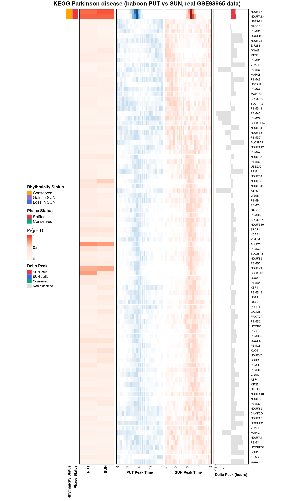
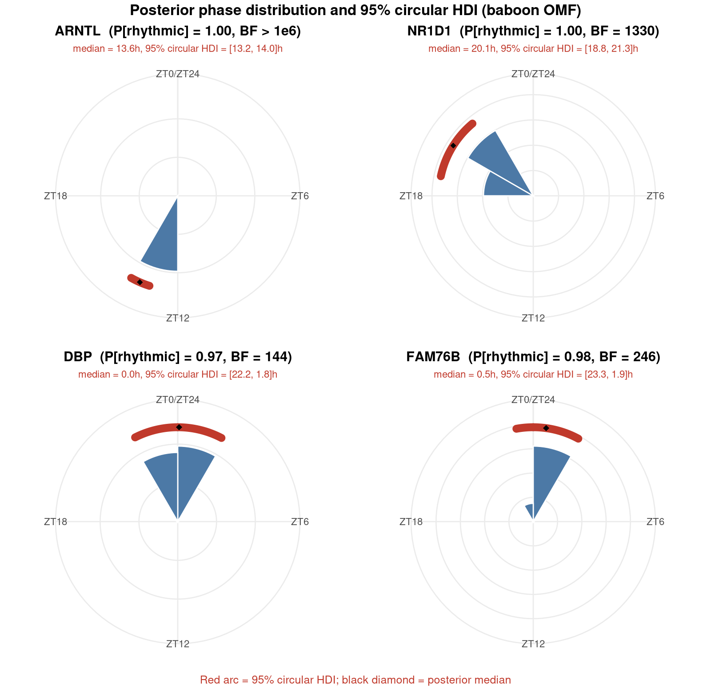

# BayRC

**Bayesian Rhythmicity Comparison** (BayRC) is a unified statistical framework for comparing and interpreting circadian rhythms across biological conditions: age, disease state, tissue, species, or sex.

BayRC jointly infers gene-level rhythmicity and phase, computes posterior probabilities of rhythmic and phase concordance, and classifies rhythmic gain, loss, conservation, and direction-specific phase shifts under Bayesian false discovery rate (BFDR) control. It further supports pathway-level enrichment and genome-wide concordance scoring, providing a unified, uncertainty-aware framework for comparative circadian analysis across tissues, species, and disease contexts.

---

## Biological Questions Answered

BayRC answers a multifaceted set of biological questions by moving through three
levels of resolution: the gene, the pathway, and the genome.

| Biological Question | Statistical Output |
|---|---|
| Which genes oscillate with a 24-hour rhythm? | Posterior P(rhythmic) + Bayes Factor per gene |
| How confident are we in the amplitude and peak timing? | Posterior estimates + 95% credible intervals (circular HDI for phase) |
| Which genes gained, lost, or conserved rhythmicity? | BFDR-controlled transition classification |
| Do conserved genes peak at the same time of day? | Circular phase concordance + 95% HDI of Δφ |
| Which biological pathways are remodeled? | Two-stage pathway enrichment + gain-loss ratio (GLR) |
| How similar are two transcriptomes globally? | Adjusted Jaccard c-score + permutation p-value + bootstrap CI |

---

## Installation

```r
install.packages("devtools")
devtools::install("path/to/BayRC")

# During development:
devtools::load_all("path/to/BayRC")
```

**Dependencies:** `Rcpp`, `circular`, `ggplot2`, `dplyr`  
**Suggested:** `ComplexHeatmap`, `KEGGREST`, `biomaRt`, `edgeR`, `DESeq2`, `parallel`

---

## Quick Start

BayRC ships a real dataset: baboon putamen (PUT) and substantia nigra (SUN)
expression, 5,066 genes, 12 zeitgeber timepoints each, from the diurnal
transcriptome atlas of [Mure et al. 2018](https://doi.org/10.1126/science.aao0318)
(GEO accession [GSE98965](https://www.ncbi.nlm.nih.gov/geo/query/acc.cgi?acc=GSE98965)),
ortholog-matched to the same gene backbone used throughout the manuscript.
It's the same PUT-vs-SUN comparison as the paper's Case Study 2, run fresh
through the current package code, not simulated data.

MCMC on the full 5,066 genes takes about 30-40 minutes per condition, so
the block below is realistic to run but not something you'd casually
re-run while reading. Every number in the comments is real output from
that run. The settings below (prior `A_prior = "trunc_Normal_OLS_condi"`,
`thin = 1`, 2,500 iterations) reproduce the prior and chain shape used to
generate the manuscript's own results, on the same real bundled data; the
full script is saved at
[`inst/analysis/quickstart_baboon_PUT_SUN.R`](inst/analysis/quickstart_baboon_PUT_SUN.R).
At this chain length and sample size (12 samples per gene) the relative
gain/loss balance already lines up closely with the manuscript (the
genome-wide gain-loss ratio below is 0.51, versus the manuscript's
published 0.53), but the absolute gene counts and pathway significance
calls are still well short of the manuscript's much longer production
chains; treat every number here as real and reproducible from this
repository, not as a restatement of the paper's own published counts.

```r
library(BayRC)

# ── STEP 1: Load the bundled data and run MCMC ────────────────────────────
baboon <- readRDS(system.file("extdata", "baboon_PUT_SUN_GSE98965.rds", package = "BayRC"))
n_genes <- nrow(baboon$expr_PUT)

data_list_PUT <- list(data = as.data.frame(log2(baboon$expr_PUT + 1)),
                      time = baboon$zt, gname = baboon$gene_symbol)
data_list_SUN <- list(data = as.data.frame(log2(baboon$expr_SUN + 1)),
                      time = baboon$zt, gname = baboon$gene_symbol)

run_mcmc <- function(dat, seed) {
  init <- CBt_init_single(Data.list = dat, P = 24, FitCosinor = TRUE,
                          mu_M = 0, sigma_M = 10, mu_A = 1, sigma_A = 10, seed = seed)
  CB_MCMC_single_rj_slice(
    Data.list = dat, Init.value = init, P = 24,
    iteration = 2500, thin = 1, n.burn = 500, seed = seed,
    p_rhythmic = rep(0.2, n_genes), rj.p.stay = 0.5,
    A_prior = "trunc_Normal_OLS_condi", mu_A = 1, sigma_A = 10^2, A.min = 0,
    A_wb_beta2 = 2, A_gm_shape = 1.99, A_gm_rate = 0.5,
    rj.phi = TRUE, rj.A = TRUE, mu_M = 0, sigma_M = 10^2,
    sigma_prior_v = 2, sigma_prior_s = 0
  )
}
mcmc_PUT <- run_mcmc(data_list_PUT, seed = 1)
mcmc_SUN <- run_mcmc(data_list_SUN, seed = 1)
# mcmc_PUT$rho — posterior samples of rhythmicity (0/1), one row per gene
# mcmc_PUT$phi — posterior samples of phase (hours, ZT scale)

# ── STEP 2: Annotate (must run before anything downstream) ───────────────
mcmc_PUT <- match_symbols(mcmc_PUT, BF = 3, p_rhythmic = 0.2)
mcmc_SUN <- match_symbols(mcmc_SUN, BF = 3, p_rhythmic = 0.2)
# match_symbols() computes a Bayes Factor per gene internally and stores the
# binary call as attr(rho, "RHYindex"); see Part 1 below for the same BF
# ranking on its own.

est_PUT <- CB_getAllEst(mcmc_PUT, burn = 50)
names(est_PUT) <- c("A", "phi", "M", "sigma")   # returned unnamed; name once for $-access

# ═══ PART 1: single-group biomarker detection ════════════════════════════
# Rank genes within one condition by Bayes Factor, before ever comparing
# conditions. BF = posterior odds / prior odds; BF > 3 is a common call.

bf_PUT <- summarize_bay(mcmc_PUT$rho, BF = 3, p_rhythmic = 0.2)
head(bf_PUT[order(-bf_PUT$BayesF), c("RowAverage", "BayesF")], 5)
#                     RowAverage    BayesF
# ENSPANG00000024811       1.00  4.0e+20   # posterior support 1.0 in every retained sample
# GMDS                      1.00  4.0e+20   # (BF is formally unbounded as posterior -> 1;
# TRA2A                     1.00  4.0e+20   #  these three never left the rhythmic state)
# CD46                      1.00  2664.0
# SH3BGRL                   1.00  1997.0

detected <- detect_rhy(mcmc_PUT, mcmc_SUN, bfdr_alpha = 0.25)
# BFDR-controlled per-condition detection (independent thresholds per
# condition, not a fixed BF cutoff): 228 rhythmic genes in PUT, 82 in SUN,
# of 5,066 tested.

# ═══ PART 2: two-group comparison ═════════════════════════════════════════
# Now compare PUT and SUN jointly: which genes gained, lost, or kept their
# rhythm, and among the kept ones, did peak timing hold or shift?

pA <- rowMeans(mcmc_PUT$rho)   # Pr(rhythmic | data), PUT
pB <- rowMeans(mcmc_SUN$rho)   # Pr(rhythmic | data), SUN

trans <- transition_classify(pA, pB, bfdr_alpha = 0.25)
# tau_gain = 0.59, n_gain = 43 | tau_loss = 0.60, n_loss = 150 | tau_cons = 0.73, n_cons = 2
# Loss-dominant remodeling (150 loss vs. 43 gain, GLR = 0.29 at the gene
# level) echoes the manuscript's own SUN-PUT finding, though at this chain
# length only 2 genes clear the joint BFDR threshold for conservation.

phase <- phase_infer(phi_matrix1 = mcmc_PUT$phi, phi_matrix2 = mcmc_SUN$phi,
                     gain_loss_status = trans$gain_loss_status,
                     shift = 2, P = 24, bfdr_alpha = 0.25, compute_hdi = TRUE)
# of the 2 conserved genes: 0 phase-conserved, 1 phase-shifted, 1 undetermined

# ── STEP 3: Two-stage pathway enrichment ──────────────────────────────────
kegg <- readRDS(system.file("extdata", "kegg_pathway_list_hsa.rds", package = "BayRC"))

result_union <- pathSelect(mcmc.merge.list = list(A = mcmc_PUT, B = mcmc_SUN),
                           pathway.list = kegg, dataset.names = c("A", "B"),
                           ranking.method = "union", score_type = "pos",
                           qvalue.cut = 0.20, nperm = 500)
active <- dplyr::filter(result_union$results, pval < 0.05)$pathway
# 27 of 220 testable pathways pass the Stage 1 pre-screen (pval < 0.05); top
# hit is KEGG Cholesterol metabolism (pval = 0.001). None reach Stage 2
# significance (padj/Q < 0.2) at this chain length; the manuscript's own
# significant findings (Proteasome loss, Oxidative phosphorylation
# conservation) come from its much longer production chains -- see the real
# precomputed-posterior pathway heatmap below for that exact result.

# ── STEP 4: Genome-wide concordance ───────────────────────────────────────
global <- multi_conservation(mcmc.merge.list = list(A = mcmc_PUT, B = mcmc_SUN),
                             dataset.names = c("A", "B"),
                             select.pathway.list = "global",
                             n_perm = 200, n_boot = 200, use_cpp = TRUE,
                             save_output = FALSE)
# AdjustedConcordance = 0.032 (95% CI 0.026-0.038), p = 0.005 -- significant
# but small, as expected at this chain length; GainLossRatio = 0.51, close
# to the manuscript's published 0.53 for the same PUT-vs-SUN comparison
```

## How BayRC Categorizes Every Gene

Every gene ends up in exactly one category at each stage, all under Bayesian
FDR control at the same alpha, no gene left unclassified. Real counts from
the run above (5,066 genes, BFDR α = 0.25):

**Part 1, single-group detection** (before the two tissues are ever compared):

| Condition | Genes tested | Rhythmic (BFDR-controlled) |
|---|---|---|
| PUT | 5,066 | 228 |
| SUN | 5,066 | 82 |

**Part 2, two-group comparison** (PUT vs. SUN jointly):

| Category | Genes | What it means |
|---|---|---|
| Conserved | 2 | Rhythmic in both tissues, confidently |
| Gain in SUN | 43 | Rhythmic in SUN only |
| Loss in SUN | 150 | Rhythmic in PUT only |
| Non-rhythmic | 4,871 | Neither tissue clears the threshold |

Loss-dominant remodeling (150 loss vs. 43 gain) matches the direction of
the manuscript's own SUN-PUT finding, though the manuscript's much longer
production chains recover far more genes overall (553 conserved, 424
loss, 121 gain at the same BFDR alpha) because BFDR calibration sharpens
with more retained posterior draws per gene.

**Within the 2 conserved genes**, a further BFDR-controlled call on peak timing:

| Phase category | Genes |
|---|---|
| Phase-conserved | 0 |
| Phase-shifted | 1 |
| Undetermined | 1 |

At this chain length the conserved set is small, so this table is not
meant to be read on its own; a longer chain (as in the manuscript)
recovers many more conserved genes and a fuller mix of phase outcomes, as
in the paper's own SUN-PUT case study and in the pathway heatmap below,
which uses the manuscript's real precomputed posterior rather than this
Quick Start's shorter chain.

---

## The BayRC Pathway Heatmap

A key deliverable of BayRC is an integrated pathway heatmap (Figure 5 in the manuscript) that reads **across five panels from left to right** for each gene in a pathway of interest:

| Panel | Shows | How to read it |
|---|---|---|
| 1. Rhythmicity status | Transition type (what happened biologically) | Orange = conserved rhythm, blue = loss in B, purple = gain in B |
| 2. Phase status | Whether peak timing shifted | Green = conserved (peaks align within ±δ hours), red = shifted (the clock resets) |
| 3. P(ρ=1 \| data), A and B | Posterior probability of oscillation in each condition | White to red gradient, 0 to 1; deep red = confident rhythmic, near white = flat. Gain genes are red only in B, loss genes only in A |
| 4. Phase posterior, condition A | MCMC posterior distribution of peak time (ZT −6 to 18) | A sharp blue bar means confident peak timing; a spread bar means high uncertainty. Low-rhythmicity genes show low intensity |
| 5. Phase posterior, condition B | Same as panel 4, for condition B | Same reading as panel 4 |

This design lets you read the entire circadian landscape of a pathway (which genes oscillate, when they peak, and whether that timing is preserved) in a single glance.

`plot_heatmap()` builds this figure from `transition_classify()` and
`phase_infer()` output. Below is a real one: KEGG Parkinson disease
(94 genes) in baboon putamen vs. substantia nigra, generated from the
manuscript's own precomputed posterior at its full production chain
length, not the Quick Start's shorter chain above (that shorter run is
real and reproducible from the bundled data, but does not reach the
manuscript's full statistical power; see the note above the categorization
table). Among the 21 conserved genes, 18 are phase-shifted and 2 are
phase-conserved, `HSPA5` and `NDUFB2`, matching the manuscript's own
published result for this pathway exactly.



---

## Key Functions

BayRC exports 21 functions, grouped below the same way the paper's Methods
section is organized (§2.1 through §2.4).

### 1. MCMC Core (paper §2.1)
| Function | Purpose |
|---|---|
| `CB_init_single()` | Initialize MCMC chain from cosinor fit or random draws |
| `CBt_init_single()` | Initialization for the pipeline's time-error-aware variant |
| `CB_MCMC_single_rj_slice()` | Core Reversible Jump MCMC sampler, the main engine |
| `CB_getAllEst()` | Posterior point estimates + 95% credible intervals; uses `circular_HDI()` for phase |
| `CBt_sim_data()` | Simulate circadian data for testing and tutorials |
| `Cosinor_fit()` | Classical OLS cosinor fit, the non-Bayesian baseline the paper contrasts BayRC with |
| `circular_HDI()` | Shortest-arc 95% credible interval for a phase posterior |
| `circular_median()` | Circular median of a phase posterior |

`circular_HDI()` matters because phase is periodic: a gene peaking near ZT23
and one peaking near ZT01 are one hour apart, not 22. A naive linear
credible interval would miss that. The panel below shows real posterior
phase distributions for four core clock genes (baboon putamen, real
GSE98965 data), with the 95% circular HDI drawn as the red arc. `DBP` and
`PER1` show an HDI that sits entirely within one day; `CSNK1E` and `NR1D2`
show the arc correctly wrapping through ZT0/ZT24, which is exactly the case
a linear interval gets wrong.



### 2. Gene-Level Biomarker Detection with BFDR Control (paper §2.2)

> **Workflow position:** `match_symbols()` runs once per condition immediately
> after MCMC and before any downstream analysis. Skipping it causes silent
> failures further down the pipeline.

**Single-group** (one condition's MCMC output at a time):

| Function | Purpose |
|---|---|
| `match_symbols()` | Annotate MCMC output with gene symbols; required before classification |
| `bfdr_from_posterior()` | BFDR threshold τ from a vector of posterior probabilities (paper Eq. 2) |
| `summarize_bay()` | Per-gene Bayes Factor: `BF = posterior_odds / prior_odds` |

**Two-group** (comparing two conditions jointly):

| Function | Purpose |
|---|---|
| `detect_rhy()` | Condition-specific rhythmic gene sets with BFDR control, one condition against the other |
| `transition_classify()` | Joint posterior BFDR for gain / loss / conservation |
| `phase_infer()` | Phase-shift vs. conservation classification + 95% circular HDI on Δφ |

### 3. Pathway-Level Rhythmic Enrichment and Directionality (paper §2.3)
| Function | Purpose |
|---|---|
| `pathSelect()` | Stage 1: `ranking.method="union"` (active pathways); Stage 2: `"gain"`, `"loss"`, `"conserved"` — one function, all stages |
| `plot_heatmap()` | The five-panel pathway heatmap described above (Figure 5 in the manuscript) |
| `multi_conservation_pathway()` | Pathway-level concordance score for a chosen gene set |
| `multi_conservation_pathway_bootstrap()` | Pathway-level concordance with bootstrap confidence intervals |

### 4. Genome-Wide Concordance Summary (paper §2.4)
| Function | Purpose |
|---|---|
| `multi_conservation()` | Full pipeline: c-score + GLR + permutation p-value + bootstrap CI |

### 5. Cross-Species Alignment

Needed only when comparing across species (e.g. the baboon-human lung
comparison in the manuscript); skip for same-species comparisons.

| Function | When to use | What it does |
|---|---|---|
| `match_homologs()` | Automated, needs internet | Uses biomaRt to find 1:1 orthologs; aligns all datasets to reference gene space |
| `merge_mcmc()` | Reproducible, needs a pre-built ortholog table | Alternative to `match_homologs()` using an explicit ortholog database; more reproducible than live biomaRt queries |

---

## Glossary

**Posterior probability.** After seeing the data, how likely a claim is, on a
scale from 0 to 1. In BayRC, P(rhythmic | data) is the posterior probability
that a gene actually oscillates on a 24-hour cycle, combining the prior
assumption with what the expression data show (paper §2.1, spike-and-slab
model).

**Bayes factor.** How much more the data support "this gene is rhythmic"
over "this gene is not," expressed as a ratio: BF = posterior odds / prior
odds. A Bayes factor of 3 means the data are 3 times more consistent with
rhythmicity than with no rhythm; higher is stronger evidence. `summarize_bay()`
computes this per gene.

**Credible interval.** The Bayesian counterpart to a confidence interval: a
range with a stated probability (usually 95%) of containing the true value,
given the data. For phase, this is computed on a circle rather than a line
(the circular highest density interval, or circular HDI; paper Supplementary
Algorithm 1), since 23:00 and 01:00 are close together, not 22 hours apart.

**Bayesian false discovery rate (BFDR).** The expected fraction of "rhythmic"
or "gained/lost/conserved" calls that are actually false positives, computed
directly from posterior probabilities rather than from p-values (Newton et al.
2004, *Biostatistics*; Müller, Parmigiani & Rice 2007, *Bayesian Statistics 8*;
Scott & Berger 2010, *Annals of Statistics*; Stephens 2016, *Biostatistics*).
BayRC picks a decision threshold so this expected fraction stays under a
chosen level (0.25 in most examples here; paper §2.2, Eq. 2), then calls
every gene that clears it.

**Circular / phase concordance.** Whether two conditions peak at the same
time of day. Because time of day wraps around every 24 hours, phase
differences have to be measured on a circle: a gene peaking at 23:00 in one
condition and 01:00 in the other is 2 hours off, not 22 (paper §2.2, part 3).

**Gain / loss / conservation.** The three ways a gene's rhythm can change
between two conditions: it can start oscillating where it didn't before
(gain), stop oscillating (loss), or keep oscillating in both (conserved).
`transition_classify()` makes this call under BFDR control (paper §2.2,
part 2).

**Genome-wide concordance (c-score).** A single number summarizing how
similar two conditions' rhythmic programs are overall, built by averaging an
adjusted Jaccard index across MCMC iterations so it propagates posterior
uncertainty rather than relying on one fixed gene list (paper §2.4, Eq. 5;
related to the congruence framework of
[Zong et al. 2023](https://doi.org/10.1073/pnas.2202584120)). Centered at 0
(no more overlap than chance) with 1 meaning perfect agreement.
`multi_conservation()` computes it along with a permutation p-value and
bootstrap confidence interval.

### References

- Mure LS, Le HD, Benegiamo G, et al. Diurnal transcriptome atlas of a primate
  across major neural and peripheral tissues. *Science*. 2018;359(6381):eaao0318.
  [10.1126/science.aao0318](https://doi.org/10.1126/science.aao0318)
- Newton MA, Noueiry A, Sarkar D, Ahlquist P. Detecting differential gene
  expression with a semiparametric hierarchical mixture method.
  *Biostatistics*. 2004;5(2):155-176.
- Müller P, Parmigiani G, Rice K. FDR and Bayesian multiple comparisons rules.
  *Bayesian Statistics 8*. 2007:349-370.
- Scott JG, Berger JO. Bayes and empirical-Bayes multiplicity adjustment in
  the variable-selection problem. *Annals of Statistics*. 2010;38(5):2587-2619.
- Stephens M. False discovery rates: a new deal. *Biostatistics*.
  2016;18(2):275-294.
- Zong W, Rahman T, Zhu L, et al. Transcriptomic congruence analysis for
  evaluating model organisms. *PNAS*. 2023;120(6):e2202584120.
  [10.1073/pnas.2202584120](https://doi.org/10.1073/pnas.2202584120)

---

## Reproducing the Manuscript Figures

Each figure in the paper is generated by a specific script in `inst/analysis/`.
The table below summarizes the mapping; see `inst/analysis/README_figures.md` for
full details on inputs and parameters.

| Figure | Description | Generating script |
|---|---|---|
| 1 | Framework overview flowchart | none (created externally as an illustration) |
| 2 | Genome-wide concordance heatmaps across 26 baboon tissues | `circa_concordance.plots.R` |
| 3 | Within-species phase concordance scatter (SCN-HIP and SUN-PUT) | `Baboon_SCN_HIP.R`, `Baboon_SUN_PUT.R` |
| 4 | SUN-PUT pathway enrichment dotplots | `Baboon_SUN_PUT.R`, `plot_enrich_SUN_PUT.R` |
| 5 | SUN-PUT heatmaps | `Baboon_SUN_PUT.R` |
| 6 | Cross-species lung circadian analysis (baboon vs human) | `Baboon_Human_LUN.R` |

These scripts depend on pre-computed MCMC `.RData` outputs for the baboon and
human tissue data, which are controlled-access or too large to bundle with the
package. The scripts are included here for transparency so the figures can be
traced to their source, but they are not runnable out of the box without that
underlying data.

---

## Citation

Pham T, Kauffman K. *BayRC: A Bayesian framework for comparative circadian genomics with FDR control and concordance scoring.* (manuscript in preparation)
