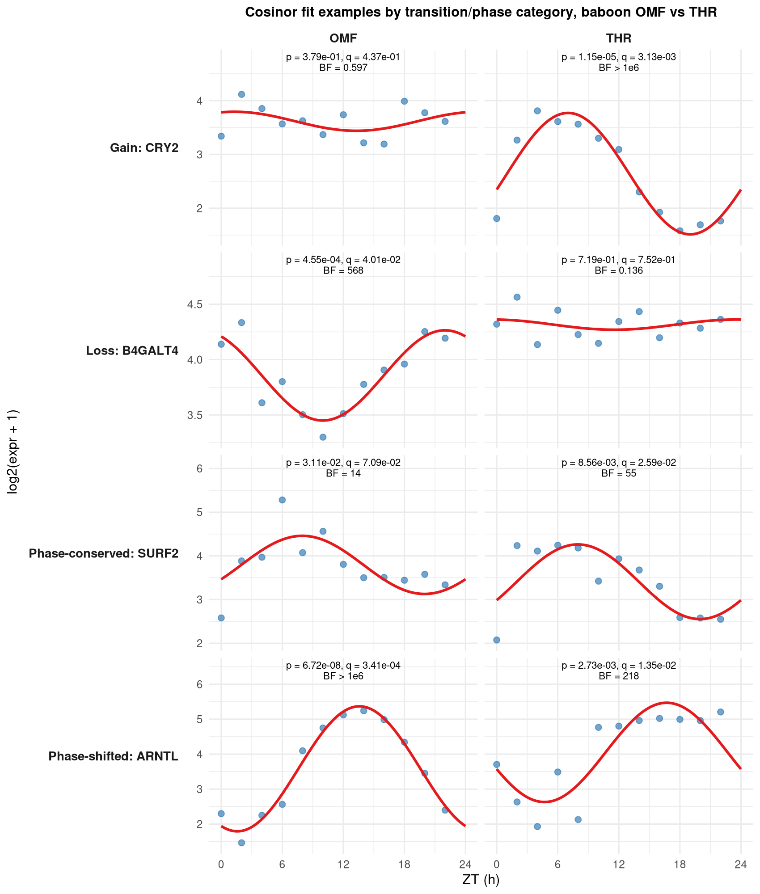
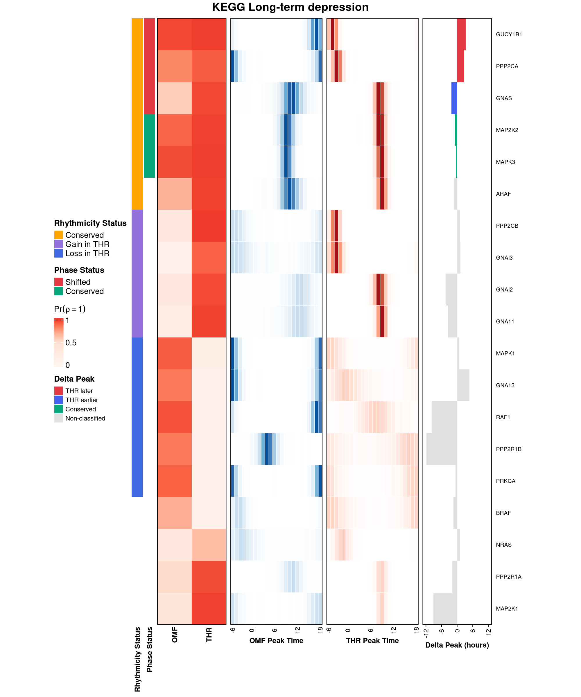
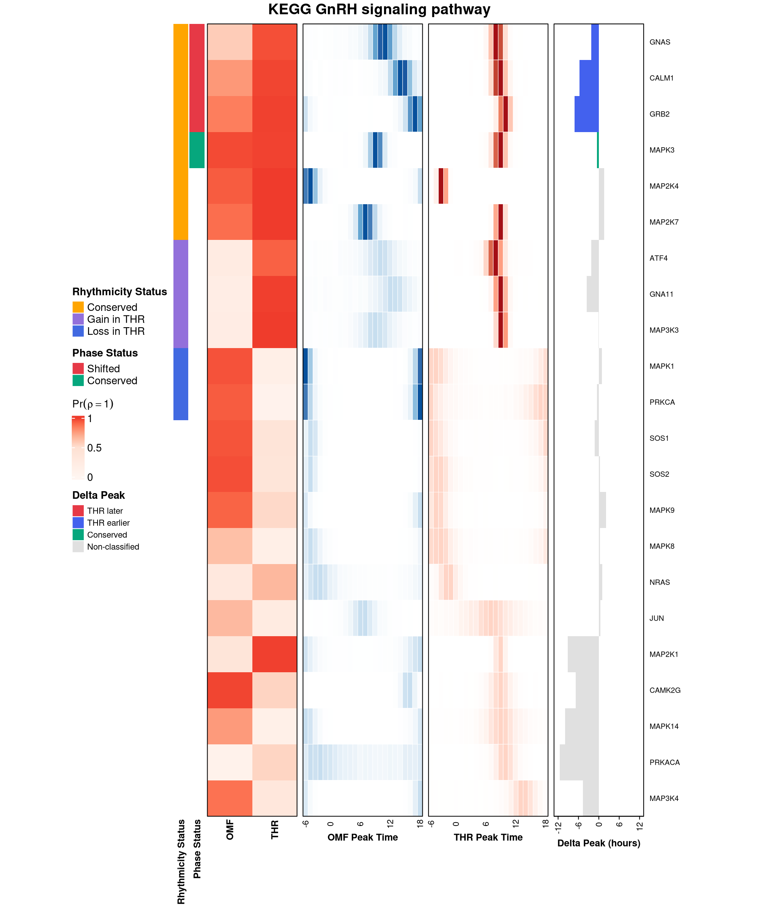

# BayRC

**Bayesian Rhythmicity Comparison** (BayRC) is a unified statistical framework for comparing and interpreting circadian rhythms across biological conditions: age, disease state, tissue, species, or sex.

BayRC jointly infers gene-level rhythmicity and phase, computes posterior probabilities of rhythmic and phase concordance, and classifies rhythmic gain, loss, conservation, and direction-specific phase shifts under Bayesian false discovery rate (BFDR) control. It further supports pathway-level enrichment and genome-wide concordance scoring, providing a unified, uncertainty-aware framework for comparative circadian analysis across tissues, species, and disease contexts.

---

## Biological Questions Answered

BayRC answers a multifaceted set of biological questions by moving through three
levels of resolution: the gene, the pathway, and the genome.

| Biological Question | Statistical Output |
|---|---|
| Which genes oscillate with a 24-hour rhythm? | Posterior P(rhythmic) + Bayes Factor per gene |
| How confident are we in the amplitude and peak timing? | Posterior estimates + 95% credible intervals (circular HDI for phase) |
| Which genes gained, lost, or conserved rhythmicity? | BFDR-controlled transition classification |
| Do conserved genes peak at the same time of day? | Circular phase concordance + 95% HDI of Δφ |
| Which biological pathways are remodeled? | Two-stage pathway enrichment + gain-loss ratio (GLR) |
| How similar are two transcriptomes globally? | Adjusted Jaccard c-score + permutation p-value + bootstrap CI |

---

## Installation

```r
install.packages(c("remotes", "BiocManager"))
options(repos = BiocManager::repositories())   # resolves the Bioconductor deps (KEGGREST, fgsea)
remotes::install_github("quythien/BayRC", upgrade = "never", build_vignettes = TRUE)
library(BayRC)
```

**Dependencies:** `Rcpp`, `circular`, `ggplot2`, `dplyr`  
**Suggested:** `ComplexHeatmap`, `KEGGREST`, `biomaRt`, `edgeR`, `DESeq2`, `parallel`

---

## Omental Fat vs. Thyroid: A Circadian Rewiring Example

Omental fat (OMF, a visceral adipose depot) and thyroid (THR) have no
direct anatomical connection, but thyroid hormone is a master regulator
of whole-body metabolic rate
([Mullur, Liu & Brent 2014](https://doi.org/10.1152/physrev.00030.2013)),
so a circadian relationship between them is biologically plausible. This
pair was found by screening posterior data across all 26 baboon tissues
in the diurnal transcriptome atlas
([Mure et al. 2018](https://doi.org/10.1126/science.aao0318)) for the
pair with the strongest, most balanced transition signal, rather than
picked in advance.

### Input Data Structure

Every MCMC run starts from the same three pieces: a gene-by-sample
expression matrix, the zeitgeber time of each sample, and gene symbols.
The bundled OMF/THR data (12 samples per tissue, sampled every 2 hours
across one 24-hour cycle) looks like this:

```r
baboon <- readRDS(system.file("extdata", "baboon_OMF_THR_GSE98965.rds", package = "BayRC"))
str(baboon, max.level = 1)
# List of 4
#  $ expr_OMF   : num [1:5066, 1:12] 79.3 49.2 165.9 33.1 67.4 ...
#  $ expr_THR   : num [1:5066, 1:12] 103.2 40.8 252.4 49.2 39.8 ...
#  $ gene_symbol: chr [1:5066] "10-Sep" "11-Sep" "2-Sep" "5-Mar" ...
#  $ zt         : num [1:12] 0 2 4 6 8 10 12 14 16 18 ...

baboon$zt   # zeitgeber time of each sample, hours since lights-on
#  [1]  0  2  4  6  8 10 12 14 16 18 20 22

round(baboon$expr_OMF[c("NR1D1", "PER1", "DBP"), 1:6], 1)   # genes x samples
#        [,1] [,2] [,3] [,4] [,5] [,6]
# NR1D1  11.1 17.4  6.1  6.9  1.7  2.8
# PER1    4.0 26.7 17.5 17.6  6.2  1.9
# DBP    14.3 31.4 17.8 10.6  8.4  9.3
```

`CB_MCMC_single_rj_slice()` and its helpers take a `Data.list`, not the
raw expression matrix directly: a list with `data` (log2-transformed
expression, genes as rows, samples as columns), `time` (the numeric
zeitgeber vector, one entry per column of `data`, same order), and
`gname` (gene symbols, one per row of `data`, same order):

```r
data_list_OMF <- list(data = as.data.frame(log2(baboon$expr_OMF + 1)),
                      time = baboon$zt, gname = baboon$gene_symbol)
str(data_list_OMF, list.len = 3)
# List of 3
#  $ data :'data.frame':	5066 obs. of  12 variables:
#  $ time : num [1:12] 0 2 4 6 8 10 12 14 16 18 ...
#  $ gname: chr [1:5066] "10-Sep" "11-Sep" "2-Sep" "5-Mar" ...
```

### Running the MCMC

With `Data.list` built, initializing and running the sampler for one
condition looks like this (the same call runs once for OMF, once for
THR):

```r
init_OMF <- CBt_init_single(Data.list = data_list_OMF, P = 24, FitCosinor = TRUE,
                            mu_M = 0, sigma_M = 10, mu_A = 1, sigma_A = 10, seed = 1)
mcmc_OMF <- CB_MCMC_single_rj_slice(
  Data.list = data_list_OMF, Init.value = init_OMF, P = 24,
  iteration = 2500, thin = 1, n.burn = 500, seed = 1,
  p_rhythmic = rep(0.2, nrow(data_list_OMF$data)), rj.p.stay = 0.5,
  A_prior = "trunc_Normal_OLS_condi", mu_A = 1, sigma_A = 10^2, A.min = 0,
  A_wb_beta2 = 2, A_gm_shape = 1.99, A_gm_rate = 0.5,
  rj.phi = TRUE, rj.A = TRUE, mu_M = 0, sigma_M = 10^2,
  sigma_prior_v = 2, sigma_prior_s = 0
)
mcmc_OMF <- match_symbols(mcmc_OMF, BF = 3, p_rhythmic = 0.2)
```

This is `inst/analysis/quickstart_baboon_OMF_THR.R`, runnable end to end
on the bundled data with no external files needed; `mcmc_THR` comes from
the same call on `data_list_THR`. 2,500 iterations with a 500-iteration
burn-in leaves 2,001 stored posterior samples per gene.
`mcmc_diagnostics()` (on by default, see Checking Convergence below) on
this real run:

```r
mcmc_diagnostics(mcmc_OMF)
# === MCMC Diagnostics ===
# Samples stored:         2001
# Mean acceptance rate:   0.319
# Mean ESS (rho):         762
# Mean ESS (phi):         389.2
```

```r
bf_OMF <- summarize_bay(mcmc_OMF$rho, BF = 3, p_rhythmic = 0.2)
head(bf_OMF[order(-bf_OMF$BayesF), c("RowAverage", "BayesF")], 5)
#                     RowAverage BayesF
# ABCF3                     1.00  4e+20
# ARNTL                     1.00  4e+20
# ATMIN                     1.00  4e+20
# ENSPANG00000009554        1.00  4e+20
# FAM214A                   1.00  4e+20   # all five: posterior support 1.0 in every
#                                          # retained sample, BF unbounded as posterior approaches 1

detected <- detect_rhy(mcmc_OMF, mcmc_THR, bfdr_alpha = 0.20)
# OMF rhythmic: 3,067 / 5,066   THR rhythmic: 3,460 / 5,066

pA <- rowMeans(mcmc_OMF$rho)
pB <- rowMeans(mcmc_THR$rho)
trans <- transition_classify(pA, pB, bfdr_alpha = 0.20)
# tau_gain = 0.662, n_gain = 512 | tau_loss = 0.703, n_loss = 326 | n_cons = 1495
# Gain, loss, and conservation are all substantially represented, with
# conservation the largest single group

phase <- phase_infer(phi_matrix1 = mcmc_OMF$phi, phi_matrix2 = mcmc_THR$phi,
                     gain_loss_status = trans$gain_loss_status,
                     shift = 2, P = 24, bfdr_alpha = 0.20, compute_hdi = TRUE)
# of the 1,495 conserved genes: 597 phase-conserved, 563 phase-shifted, 335 undetermined
```

What these categories actually look like in the raw data: one example
gene per category, plotted in both tissues with a classical OLS cosinor
fit overlaid. `Cosinor_fit()` runs `one_cosinor_OLS()` (the non-Bayesian
baseline BayRC also ships) across every gene and BH-adjusts the p-values
into q-values, so each panel below shows a real p and q, not just a
single-gene p-value; this classical fit is for visualization only, it
isn't what produced the gain/loss/phase calls above, those come from the
RJMCMC posterior:

```r
rhythm_OMF <- Cosinor_fit(list(data = log2(baboon$expr_OMF + 1),
                               time = baboon$zt, gname = baboon$gene_symbol))$rhythm
rhythm_OMF[rhythm_OMF$gname == "CRY2", c("pvalue", "qvalue")]
```



`CRY2`, a core clock repressor, illustrates Gain: not significant in OMF
(q = 0.44) and clearly rhythmic in THR (q = 0.003, BF > 1e6). `B4GALT4`
(Loss) is the mirror image (OMF q = 0.04, THR q = 0.75). `SURF2`
(Phase-conserved) peaks at the same hour (8.0h) in both tissues (q =
0.07 in OMF, borderline; q = 0.03 in THR). `ARNTL` (BMAL1, the core clock
activator) illustrates Phase-shifted: peak = 13.6h in OMF vs. 16.7h in
THR, a real ~3h shift, significant in both tissues (q = 0.0003 and
0.014).

```r
kegg <- readRDS(system.file("extdata", "kegg_pathway_list_hsa.rds", package = "BayRC"))

# pathSelect() tests one transition direction per call. Testing all three
# directly against the same 220 testable KEGG pathways:
result_gain <- pathSelect(mcmc.merge.list = list(A = mcmc_OMF, B = mcmc_THR),
                          pathway.list = kegg, dataset.names = c("A", "B"),
                          ranking.method = "gain", score_type = "pos",
                          qvalue.cut = 0.20, nperm = 500)
result_loss <- pathSelect(mcmc.merge.list = list(A = mcmc_OMF, B = mcmc_THR),
                          pathway.list = kegg, dataset.names = c("A", "B"),
                          ranking.method = "loss", score_type = "pos",
                          qvalue.cut = 0.20, nperm = 500)
result_cons <- pathSelect(mcmc.merge.list = list(A = mcmc_OMF, B = mcmc_THR),
                          pathway.list = kegg, dataset.names = c("A", "B"),
                          ranking.method = "conserved", score_type = "pos",
                          qvalue.cut = 0.20, nperm = 500)
# gain: 0 of 220 significant (padj < 0.20)
# loss: 24 of 220 significant, top hit KEGG Long-term depression (Q = 0.0065);
#       KEGG Circadian rhythm and KEGG Circadian entrainment score in this
#       direction too but don't clear the cutoff at this run's scale
#       (Q = 0.29 and Q = 0.31)
# conserved: 1 of 220 significant (KEGG DNA replication, Q = 0.17)
#
# Loss is the only direction with a strong pathway-level signal here, even
# though the gene-level counts above show a substantial gain set too:
# pathway enrichment and gene-level counts are different questions.

global <- multi_conservation(mcmc.merge.list = list(A = mcmc_OMF, B = mcmc_THR),
                             dataset.names = c("A", "B"),
                             select.pathway.list = "global",
                             n_perm = 200, n_boot = 200, use_cpp = TRUE,
                             save_output = FALSE)
# AdjustedConcordance = 0.069 (95% CI 0.058-0.079), p = 0.005
# GainLossRatio = 1.129
```

The gain-loss ratio (GLR) is the expected number of genes gained divided
by the expected number lost. GLR > 1 means more rhythmicity is being
gained than lost between the two conditions; GLR < 1 means more is being
lost than gained; GLR close to 1 means gain and loss are roughly
balanced. `multi_conservation()` reports GLR genome-wide: here GLR =
1.129, close to 1, so across the whole transcriptome gain and loss are
roughly balanced, with a slight lean toward gain. `pathSelect()` reports
the same quantity per pathway (the `Gain_Loss_Ratio_Arithmetic` column in
its results table): KEGG Long-term depression, the strongest loss-hit
above, has GLR = 1.35, higher than the genome-wide value, meaning that
within this specific pathway, more of its genes gained rhythmicity than
lost it, even though the pathway as a whole is significant for loss
enrichment. That a pathway is significant for loss enrichment means its
genes score higher on the loss-ranking statistic than a random gene set
of the same size would, not that its raw gain-to-loss ratio is below 1;
those are two different measurements, and a pathway can be significant
for loss while still having a gain-leaning GLR.

---

## Checking Convergence

Every number above assumes the MCMC chain converged and mixed well. BayRC
checks this with `mcmc_diagnostics()`, which runs
automatically (`diagnostics = TRUE` by default in
`CB_MCMC_single_rj_slice()`) and can also be called later on any saved
result, since the underlying `rho`, `phi`, and `if.accept.rj` matrices are
always stored regardless of that flag. This is the same
`mcmc_diagnostics(mcmc_OMF)` call shown under Running the MCMC above:
acceptance rate 0.319, ESS(rho) 762, ESS(phi) 389.2, from 2,001 stored
samples.

Here's how to read those three numbers. The acceptance rate of 0.319
means about a third of proposed RJMCMC moves (birth, death, or update)
were accepted; healthy Metropolis-Hastings samplers typically fall
somewhere between 0.2 and 0.5, so this indicates the chain is exploring
rather than getting stuck. ESS(rho) of 762 out of 2,001 stored samples
means the binary rhythmicity calls are mixing reasonably well, close to
2 samples per independent draw. ESS(phi) of 389.2 is lower, which on its
own would look worse, but ESS for phi needs a word of caution: it isn't
simply "higher is better." A gene with a diffuse, unconfident phase
posterior can show artificially *high* ESS, because each draw is close
to independent of the last when there's little real signal to get stuck
on. A gene with a tight, confident posterior can show *low* ESS if the
sampler moves in small steps within that narrow region from iteration to
iteration, even though the estimate itself is trustworthy. Together,
these three numbers demonstrate the chain is mixing adequately rather
than stuck or degenerate; read ESS for phi alongside the posterior
rhythmicity probability for that gene, not on its own.

---

## Expected Rhythmic Counts, Before Any Threshold

Before any BFDR cutoff is applied, every gene already carries a posterior
probability of being rhythmic, gained, lost, or conserved. Summing these
probabilities across all 5,066 genes gives an expected count: the same
threshold-free quantity `pathSelect()` reports per pathway (see the
Pathway Heatmap section below), applied here to the whole genome instead
of one pathway at a time.

```r
pA <- rowMeans(mcmc_OMF$rho)
pB <- rowMeans(mcmc_THR$rho)
sum(pA)                    # 2,869.9 of 5,066: expected rhythmic in OMF
sum(pB)                    # 3,005.0 of 5,066: expected rhythmic in THR
sum((1 - pA) * pB)        # 1,184.9: expected gain
sum(pA * (1 - pB))        # 1,049.8: expected loss
sum(pA * pB)               # 1,820.0: expected conserved
sum((1 - pA) * (1 - pB))  # 1,011.2: expected non-rhythmic in both
```

**Expected rhythmic per condition:**

| Condition | Genes tested | Expected rhythmic |
|---|---|---|
| OMF | 5,066 | 2,869.9 |
| THR | 5,066 | 3,005.0 |

**Expected transition counts, genome-wide** (rows and columns sum to the
totals above; all four cells sum to 5,066):

| | THR rhythmic | THR non-rhythmic | Row total |
|---|---|---|---|
| **OMF rhythmic** | 1,820.0 (conserved) | 1,049.8 (loss in THR) | 2,869.9 |
| **OMF non-rhythmic** | 1,184.9 (gain in THR) | 1,011.2 (non-rhythmic in both) | 2,196.1 |
| **Column total** | 3,005.0 | 2,061.0 | 5,066 |

The expected gain-loss ratio here (1,184.9 / 1,049.8 = 1.13) matches
`multi_conservation()`'s GainLossRatio of 1.129 above almost exactly:
both are threshold-free, continuous quantities computed the same way,
just at different granularity (whole-genome sum vs. the
permutation-calibrated version). The discrete, BFDR-thresholded counts in
the next section (512 gain, 326 loss, ratio 1.57) diverge more, since
thresholding at α = 0.20 doesn't affect the gain and loss directions
symmetrically for this pair.

---

## How BayRC Categorizes Every Gene

Every gene ends up in exactly one category at each stage, all under Bayesian
FDR control at the same alpha, no gene left unclassified. Real counts from
the run above (5,066 genes, BFDR α = 0.20):

**Single-group detection** (before the two tissues are ever compared). The
last three columns are per-gene Bayes Factor cutoffs shown for
comparison; they don't correct for testing 5,066 genes at once, so the
BFDR-controlled column is the one used everywhere else in this
walkthrough (see [Rhythmic Biomarker Summary](#rhythmic-biomarker-summary)
for why these differ):

| Condition | Genes tested | Rhythmic (BFDR-controlled, α=0.20) | BF ≥ 3 | BF ≥ 5 | BF ≥ 10 |
|---|---|---|---|---|---|
| OMF | 5,066 | 3,067 | 3,128 | 2,705 | 2,134 |
| THR | 5,066 | 3,460 | 3,092 | 2,790 | 2,408 |

**Two-group comparison** (OMF vs. THR jointly):

| Category | Genes | What it means |
|---|---|---|
| Conserved | 1,495 | Rhythmic in both tissues, confidently |
| Gain in THR | 512 | Rhythmic in THR only |
| Loss in THR | 326 | Rhythmic in OMF only |
| Non-rhythmic | 2,733 | Neither tissue clears the threshold |

The large conserved set points to a shared core clock program between
these tissues, while the substantial gain and loss sets show
tissue-specific rhythmicity on top of it: genes whose oscillation is
switched on or off depending on which tissue they're in.

**Within the 1,495 conserved genes**, a further BFDR-controlled call on peak timing:

| Phase category | Genes |
|---|---|
| Phase-conserved | 597 |
| Phase-shifted | 563 |
| Undetermined | 335 |

Close to an even split between genes that keep their peak timing and
genes whose timing shifts, with a meaningful undetermined band. The phase
call has its own BFDR threshold, separate from the one used to call a
gene conserved in the first place, so some genes clear the first bar
without also clearing the second.

---

## Rhythmic Biomarker Summary

A raw Bayes Factor cutoff is a per-gene evidence threshold, similar in
spirit to a p-value cutoff in classical hypothesis testing. It quantifies
the strength of evidence for rhythmicity in a single gene (`BF =
posterior_odds / prior_odds`, using a 20% prior prevalence, `p_rhythmic =
0.2`, below), but it says nothing about the expected error rate once
thousands of genes are tested together. BFDR control addresses that
directly: it sets a data-adaptive threshold per condition, calibrated
across the whole gene set rather than gene by gene, so the expected false
discovery rate stays under a chosen level. That's the default criterion
for every gain/loss/conservation call in this walkthrough. The table
below shows both computed on the same OMF/THR posteriors.

```r
bf_OMF <- summarize_bay(mcmc_OMF$rho, BF = 3, p_rhythmic = 0.2)
bf_THR <- summarize_bay(mcmc_THR$rho, BF = 3, p_rhythmic = 0.2)

sum(bf_OMF$BayesF >= 3, na.rm = TRUE)   # 3,128 of 5,066: "positive" evidence (Kass & Raftery 1995)
sum(bf_OMF$BayesF >= 10, na.rm = TRUE)  # 2,134 of 5,066: "strong" evidence, same scale

d <- detect_rhy(mcmc_OMF, mcmc_THR, bfdr_alpha = 0.20)
d$n_rhythmic_A  # 3,067 of 5,066
```

| Criterion | OMF rhythmic | THR rhythmic |
|---|---|---|
| Bayes Factor ≥ 3 ("positive" evidence) | 3,128 / 5,066 | 3,092 / 5,066 |
| Bayes Factor ≥ 5 | 2,705 / 5,066 | 2,790 / 5,066 |
| Bayes Factor ≥ 10 ("strong" evidence) | 2,134 / 5,066 | 2,408 / 5,066 |
| BFDR-controlled, α = 0.20 | 3,067 / 5,066 | 3,460 / 5,066 |
| BFDR-controlled, α = 0.15 | 2,607 / 5,066 | 3,099 / 5,066 |
| BFDR-controlled, α = 0.10 | 2,061 / 5,066 | 2,701 / 5,066 |
| BFDR-controlled, α = 0.05 | 1,320 / 5,066 | 2,165 / 5,066 |

These two criteria won't always agree gene-for-gene, and they don't here.
Read the Bayes Factor counts as a quick per-gene screen; report the
BFDR-controlled counts as the calibrated biomarker list.

---

## The BayRC Pathway Heatmap

One of BayRC's main outputs is an integrated pathway heatmap (Figure 5 in the manuscript) that reads **across six panels from left to right** for each gene in a pathway of interest:

| Panel | Shows | How to read it |
|---|---|---|
| 1. Rhythmicity status | Transition type (what happened biologically) | Orange = conserved rhythm, purple = gain in condition B, blue = loss in B |
| 2. Phase status | Whether peak timing shifted, for conserved genes only | Green = conserved (peaks align within the tolerance), red = shifted (the clock resets) |
| 3. P(ρ=1 \| data), A and B | Posterior probability of oscillation in each condition | White to red gradient, 0 to 1; deep red = confident rhythmic, near white = flat |
| 4. Phase posterior, condition A | MCMC posterior distribution of peak time (ZT −6 to 18) | A sharp bar means confident peak timing; a spread-out bar means high phase uncertainty |
| 5. Phase posterior, condition B | Same as panel 4, for condition B | Compare bar position against panel 4 to see the shift visually |
| 6. Delta peak (hours) | Signed peak-time difference, B minus A | Positive = B peaks later; negative = B peaks earlier; gray = not classified (gain, loss, or undetermined phase) |

This design lets you read the entire circadian landscape of a pathway (which genes oscillate, when they peak, and whether that timing is preserved) in a single glance.

`plot_heatmap()` builds this figure from `transition_classify()` and
`phase_infer()` output, one pathway at a time, and picking which pathway
to plot starts with deciding what kind of enrichment to look for.
`pathSelect()` can test a pathway for enrichment in any of three
transition directions:

- **Gain**: genes in this pathway tend to have become rhythmic in THR
  that weren't rhythmic in OMF, i.e. the pathway looks newly recruited
  into circadian control in THR.
- **Loss**: genes in this pathway tend to have been rhythmic in OMF and
  lost that rhythmicity in THR, i.e. the pathway looks like it's dropped
  out of circadian control in THR.
- **Conserved**: genes in this pathway tend to stay rhythmic in both
  tissues, i.e. the pathway looks like a shared, tissue-independent
  circadian program.

Once a direction is chosen, `pathSelect()` tests every pathway against
it. For loss, which is where this pair's real pathway-level signal is:

```r
result_loss <- pathSelect(mcmc.merge.list = list(A = mcmc_OMF, B = mcmc_THR),
                          pathway.list = kegg, dataset.names = c("A", "B"),
                          ranking.method = "loss", score_type = "pos",
                          qvalue.cut = 0.20, nperm = 500)
```

Its p-value is a permutation-based enrichment test (one-sided fgsea)
asking whether this pathway's genes score higher on the loss-direction
ranking statistic than a random gene set of the same size would, under
repeated gene-label permutation. Q is that same p-value BH-adjusted
across all 220 pathways tested; both columns describe loss enrichment
only. Exp. gain / loss / conserved are a separate thing, already computed
for you inside `result_loss$results`, no extra step needed:

```r
top10 <- result_loss$results[order(result_loss$results$padj), ][1:10, ]
top10[, c("pathway", "size", "pval", "padj",
          "Expected_N_Gain", "Expected_N_Loss", "Expected_N_Conserved")]
```

These are the same continuous, posterior-weighted expected gene counts
as the genome-wide table above, just restricted to this pathway's genes,
not a significance test in their own right. The 10 strongest hits from
`result_loss`, sorted by Q:

| Pathway | Size | Loss p-value | Loss Q | Exp. gain | Exp. loss | Exp. conserved |
|---|---|---|---|---|---|---|
| KEGG Long-term depression | 16 | 3.0e-05 | 0.0065 | 5.5 | 4.1 | 5.4 |
| KEGG GnRH signaling pathway | 22 | 2.4e-04 | 0.0258 | 5.2 | 6.2 | 8.8 |
| KEGG ErbB signaling pathway | 33 | 9.5e-04 | 0.0542 | 6.3 | 10.2 | 13.2 |
| KEGG Serotonergic synapse | 18 | 9.9e-04 | 0.0542 | 6.5 | 4.0 | 5.6 |
| KEGG IL-17 signaling pathway | 26 | 1.6e-03 | 0.0616 | 3.5 | 8.1 | 9.9 |
| KEGG Renal cell carcinoma | 33 | 1.7e-03 | 0.0616 | 7.5 | 8.2 | 13.7 |
| KEGG Alcoholic liver disease | 42 | 2.1e-03 | 0.0616 | 7.0 | 12.4 | 15.6 |
| KEGG Apelin signaling pathway | 34 | 2.2e-03 | 0.0616 | 8.7 | 9.0 | 12.8 |
| KEGG Relaxin signaling pathway | 42 | 2.7e-03 | 0.0665 | 10.5 | 10.7 | 15.4 |
| KEGG Non-small cell lung cancer | 26 | 3.1e-03 | 0.0672 | 6.1 | 6.4 | 11.1 |

24 pathways clear Q < 0.20 in total. KEGG Circadian rhythm and KEGG
Circadian entrainment also show up in this loss-ranked list, but at this
run's scale they don't clear the cutoff (Q = 0.29 and Q = 0.31). Any
pathway name that clears the cutoff can be passed straight into
`plot_heatmap()`, together with its member genes from `kegg` and the
`trans` and `phase` objects already computed above:

```r
pathway_name <- "KEGG Long-term depression"   # a significant loss-direction hit

plot_heatmap(
  data1 = mcmc_OMF, data2 = mcmc_THR,
  pathway_genes = kegg[[pathway_name]],
  pathway_name  = pathway_name,
  phase_results = phase, transition_results = trans,
  group_names = c("OMF", "THR")
)
```

Two examples below, both significant loss-direction hits from the same
OMF-vs-THR posterior:

**KEGG Long-term depression** (padj = 0.0065, the strongest statistical
hit) has a genuinely mixed gene-level picture: of 16 matched genes, 4
gain in THR, 4 loss in THR, 4 maintained, 4 non-rhythmic.



**KEGG GnRH signaling pathway** (padj = 0.0258, the second-strongest hit)
has 22 matched genes: 3 gain in THR, 2 loss in THR, 6 maintained, 11
non-rhythmic.



---

## Key Functions

BayRC exports 23 functions, grouped below the same way the paper's Methods
section is organized (§2.1 through §2.4).

### 1. MCMC Core (paper §2.1)
| Function | Purpose |
|---|---|
| `CB_init_single()` | Initialize MCMC chain from cosinor fit or random draws |
| `CBt_init_single()` | Initialization for the pipeline's time-error-aware variant |
| `CB_MCMC_single_rj_slice()` | Core Reversible Jump MCMC sampler, the main engine |
| `CB_getAllEst()` | Posterior point estimates + 95% credible intervals; uses `circular_HDI()` for phase |
| `mcmc_diagnostics()` | Convergence diagnostics (RJMCMC acceptance rate, ESS for rho and phi); runs automatically (`diagnostics = TRUE` by default) or can be called later on any saved MCMC result |
| `CBt_sim_data()` | Simulate circadian data for testing and tutorials |
| `Cosinor_fit()` | Classical OLS cosinor fit, the non-Bayesian baseline the paper contrasts BayRC with |
| `circular_HDI()` | Shortest-arc 95% credible interval for a phase posterior |
| `circular_median()` | Circular median of a phase posterior |

Phase is periodic, so a standard linear credible interval doesn't work for
it: a gene peaking near ZT23 and one peaking near ZT01 are one hour apart,
not 22, and a linear interval would miss that. `circular_HDI()` computes
the interval directly on the circle instead. The panel below shows posterior
phase distributions for four genes in baboon omental fat, all with
posterior P(rhythmic) > 0.9, from the same posterior used throughout the
walkthrough above. `ARNTL` (BMAL1) and `NR1D1`, both core clock genes,
show an HDI that sits entirely within one day; `DBP` (also a core clock
gene) and `FAM76B` show the arc correctly wrapping through ZT0/ZT24,
which is exactly the case a linear interval gets wrong. All four genes
were chosen for high confidence (posterior P(rhythmic) between 0.973 and
1.00) so the wrapping behavior reflects real signal, not sampling noise
from a weakly-rhythmic gene.


### 2. Gene-Level Biomarker Detection with BFDR Control (paper §2.2)

> **Workflow position:** `match_symbols()` runs once per condition immediately
> after MCMC and before any downstream analysis. Skipping it causes silent
> failures further down the pipeline.

**Single-group** (one condition's MCMC output at a time):

| Function | Purpose |
|---|---|
| `match_symbols()` | Annotate MCMC output with gene symbols; required before classification |
| `bfdr_from_posterior()` | BFDR threshold τ from a vector of posterior probabilities (paper Eq. 2) |
| `summarize_bay()` | Per-gene Bayes Factor: `BF = posterior_odds / prior_odds` |

**Two-group** (comparing two conditions jointly):

| Function | Purpose |
|---|---|
| `detect_rhy()` | Condition-specific rhythmic gene sets with BFDR control, one condition against the other |
| `transition_classify()` | Joint posterior BFDR for gain / loss / conservation |
| `phase_infer()` | Phase-shift vs. conservation classification + 95% circular HDI on Δφ |

### 3. Pathway-Level Rhythmic Enrichment and Directionality (paper §2.3)
| Function | Purpose |
|---|---|
| `pathSelect()` | Pathway enrichment test for a chosen transition direction; `ranking.method` sets which one (`"gain"`, `"loss"`, `"conserved"`, or `"union"` for combined rhythmic signal in either direction) |
| `plot_heatmap()` | The six-panel pathway heatmap described above (Figure 5 in the manuscript) |
| `multi_conservation_pathway()` | Pathway-level concordance score for a chosen gene set |
| `multi_conservation_pathway_bootstrap()` | Pathway-level concordance with bootstrap confidence intervals |

### 4. Genome-Wide Concordance Summary (paper §2.4)
| Function | Purpose |
|---|---|
| `multi_conservation()` | Full pipeline: c-score + GLR + permutation p-value + bootstrap CI |
| `pairwise_concordance()` | Pairwise Jaccard concordance matrix across more than two tissues or conditions at once; the multi-way extension of `multi_conservation()`'s two-condition score |

### 5. Cross-Species Alignment

Needed only when comparing across species (e.g. the baboon-human lung
comparison in the manuscript); skip for same-species comparisons.

| Function | When to use | What it does |
|---|---|---|
| `match_homologs()` | Automated, needs internet | Uses biomaRt to find 1:1 orthologs; aligns all datasets to reference gene space |
| `merge_mcmc()` | Reproducible, needs a pre-built ortholog table | Alternative to `match_homologs()` using an explicit ortholog database; more reproducible than live biomaRt queries |

---

## Glossary

**Posterior probability.** After seeing the data, how likely a claim is, on a
scale from 0 to 1. In BayRC, P(rhythmic | data) is the posterior probability
that a gene oscillates on a 24-hour cycle, combining the prior
assumption with what the expression data show (paper §2.1, spike-and-slab
model).

**Bayes factor.** How much more the data support "this gene is rhythmic"
over "this gene is not," expressed as a ratio: BF = posterior odds / prior
odds. A Bayes factor of 3 means the data are 3 times more consistent with
rhythmicity than with no rhythm; higher is stronger evidence. `summarize_bay()`
computes this per gene.

**Credible interval.** The Bayesian counterpart to a confidence interval: a
range with a stated probability (usually 95%) of containing the true value,
given the data. For phase, this is computed on a circle rather than a line
(the circular highest density interval, or circular HDI; paper Supplementary
Algorithm 1) for the same reason described under Circular / phase
concordance below.

**Bayesian false discovery rate (BFDR).** The expected fraction of "rhythmic"
or "gained/lost/conserved" calls that are actually false positives, computed
directly from posterior probabilities rather than from p-values (Newton et al.
2004, *Biostatistics*; Müller, Parmigiani & Rice 2007, *Bayesian Statistics 8*;
Scott & Berger 2010, *Annals of Statistics*; Stephens 2016, *Biostatistics*).
BayRC picks a decision threshold so this expected fraction stays under a
chosen level (0.20 in most examples here; paper §2.2, Eq. 2), then calls
every gene that clears it.

**Circular / phase concordance.** Whether two conditions peak at the same
time of day. Because time of day wraps around every 24 hours, phase
differences have to be measured on a circle: a gene peaking at 23:00 in one
condition and 01:00 in the other is 2 hours off, not 22 (paper §2.2, part 3).

**Gain / loss / conservation.** The three ways a gene's rhythm can change
between two conditions: it can start oscillating where it didn't before
(gain), stop oscillating (loss), or keep oscillating in both (conserved).
`transition_classify()` makes this call under BFDR control (paper §2.2,
part 2).

**Genome-wide concordance (c-score).** A single number summarizing how
similar two conditions' rhythmic programs are overall, built by averaging an
adjusted Jaccard index across MCMC iterations so it propagates posterior
uncertainty rather than relying on one fixed gene list (paper §2.4, Eq. 5;
related to the congruence framework of
[Zong et al. 2023](https://doi.org/10.1073/pnas.2202584120)). Centered at 0
(no more overlap than chance) with 1 meaning perfect agreement.
`multi_conservation()` computes it along with a permutation p-value and
bootstrap confidence interval.

### References

- Mure LS, Le HD, Benegiamo G, et al. Diurnal transcriptome atlas of a primate
  across major neural and peripheral tissues. *Science*. 2018;359(6381):eaao0318.
  [10.1126/science.aao0318](https://doi.org/10.1126/science.aao0318)
- Mullur R, Liu YY, Brent GA. Thyroid hormone regulation of metabolism.
  *Physiological Reviews*. 2014;94(2):355-382.
  [10.1152/physrev.00030.2013](https://doi.org/10.1152/physrev.00030.2013)
- Newton MA, Noueiry A, Sarkar D, Ahlquist P. Detecting differential gene
  expression with a semiparametric hierarchical mixture method.
  *Biostatistics*. 2004;5(2):155-176.
- Müller P, Parmigiani G, Rice K. FDR and Bayesian multiple comparisons rules.
  *Bayesian Statistics 8*. 2007:349-370.
- Scott JG, Berger JO. Bayes and empirical-Bayes multiplicity adjustment in
  the variable-selection problem. *Annals of Statistics*. 2010;38(5):2587-2619.
- Stephens M. False discovery rates: a new deal. *Biostatistics*.
  2016;18(2):275-294.
- Zong W, Rahman T, Zhu L, et al. Transcriptomic congruence analysis for
  evaluating model organisms. *PNAS*. 2023;120(6):e2202584120.
  [10.1073/pnas.2202584120](https://doi.org/10.1073/pnas.2202584120)

---

## Reproducing the Manuscript Figures

Each figure in the paper is generated by a specific script in `inst/analysis/`.
The table below summarizes the mapping; see `inst/analysis/README_figures.md` for
full details on inputs and parameters.

| Figure | Description | Generating script |
|---|---|---|
| 1 | Framework overview flowchart | none (created externally as an illustration) |
| 2 | Genome-wide concordance heatmaps across 26 baboon tissues | `circa_concordance.plots.R` |
| 3 | Within-species phase concordance scatter (SCN-HIP and SUN-PUT) | `Baboon_SCN_HIP.R`, `Baboon_SUN_PUT.R` |
| 4 | SUN-PUT pathway enrichment dotplots | `Baboon_SUN_PUT.R`, `plot_enrich_SUN_PUT.R` |
| 5 | SUN-PUT heatmaps | `Baboon_SUN_PUT.R` |
| 6 | Cross-species lung circadian analysis (baboon vs human) | `Baboon_Human_LUN.R` |

These scripts depend on pre-computed MCMC `.RData` outputs for the baboon and
human tissue data, which are controlled-access or too large to bundle with the
package. The scripts are included here for transparency so the figures can be
traced to their source, but they are not runnable out of the box without that
underlying data.

---

## Citation

Pham T, et al. *BayesRC: a comparative Bayesian multilevel framework for evaluating circadian synchrony across conditions.* (manuscript in preparation)
