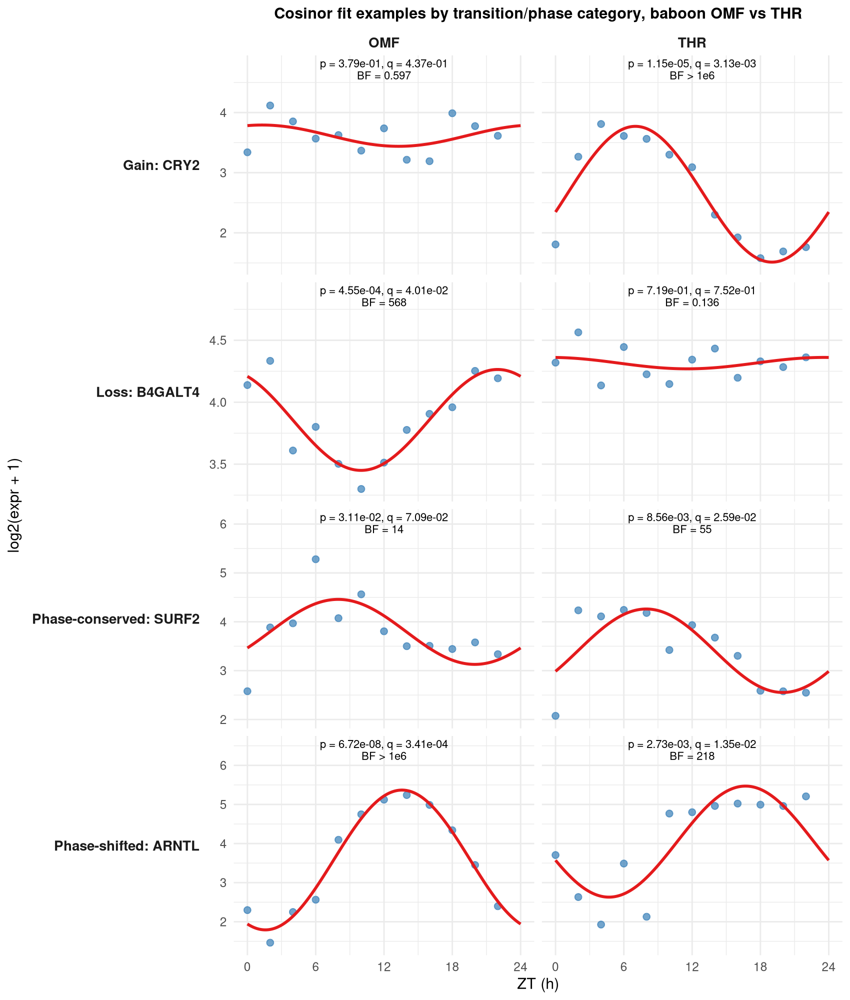
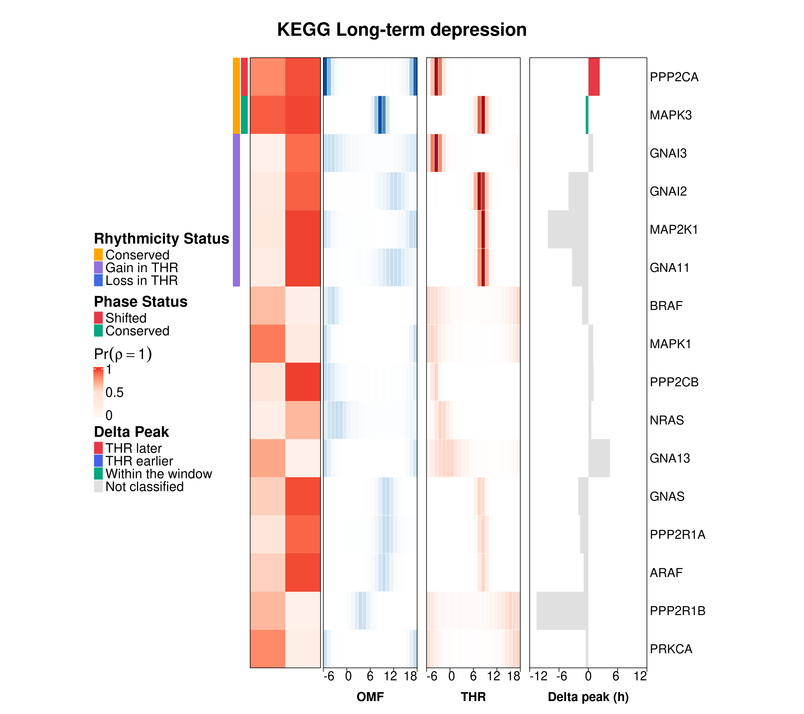
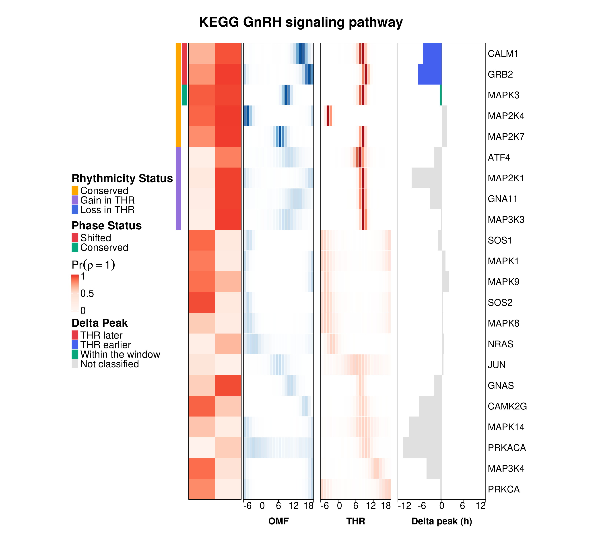
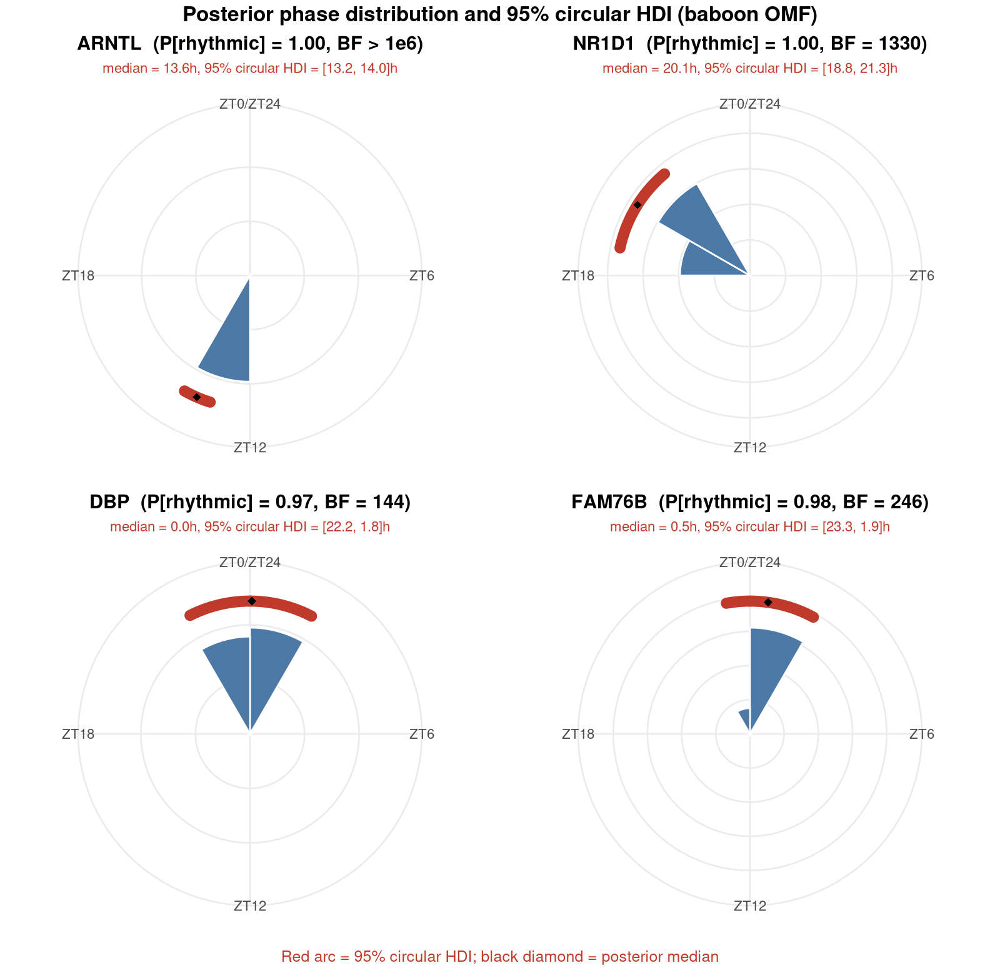

# BayRC

**Bayesian Rhythmicity Comparison** (BayRC) is a statistical framework for
comparing circadian rhythms across biological conditions, such as age, disease
state, tissue, species, or sex.

BayRC jointly infers gene-level rhythmicity and phase, quantifies rhythmic and
phase concordance between conditions, and classifies rhythmic gain, loss, and
conservation under Bayesian false discovery rate (BFDR) control. It also
supports pathway-level enrichment analysis and genome-wide concordance scoring,
providing an uncertainty-aware framework for comparative circadian analysis.

---

## Biological Questions Answered

BayRC addresses circadian comparison at three levels of resolution: the gene,
the pathway, and the genome.

| Biological Question | Statistical Output |
|---|---|
| Which genes oscillate with a 24-hour rhythm? | Posterior P(rhythmic) + Bayes Factor per gene |
| How confident are we in the amplitude and peak timing? | Posterior estimates + 95% credible intervals (circular HDI for phase) |
| Which genes gained, lost, or conserved rhythmicity? | BFDR-controlled transition classification |
| Do conserved genes peak at the same time of day? | Circular phase concordance + 95% HDI of Δφ |
| Which biological pathways are remodeled? | Two-stage pathway enrichment + gain-loss ratio (GLR) |
| How similar are two transcriptomes globally? | Adjusted Jaccard c-score + permutation p-value + bootstrap CI |

---


## Installation

```r
install.packages(c("remotes", "BiocManager"))
options(repos = BiocManager::repositories())   # resolves Bioconductor dependencies (e.g. KEGGREST, fgsea)
remotes::install_github("quythien/BayRC", upgrade = "never", build_vignettes = TRUE)
library(BayRC)

```

**Imports:** `Rcpp`, `circular`, `ggplot2`, `dplyr`, `fgsea`, `KEGGREST`, and others (see `DESCRIPTION`)  
**Suggests:** `ComplexHeatmap`, `circlize`, `biomaRt`, `knitr`, `rmarkdown`, and others (see `DESCRIPTION`)

---

## Quickstart

The bundled baboon omental fat (OMF) and thyroid (THR) dataset provides a
minimal end-to-end example.

```r
baboon <- readRDS(system.file("extdata", "baboon_OMF_THR_GSE98965.rds", package = "BayRC"))

data_list_OMF <- list(data = as.data.frame(log2(baboon$expr_OMF + 1)),
                      time = baboon$zt, gname = baboon$gene_symbol)
data_list_THR <- list(data = as.data.frame(log2(baboon$expr_THR + 1)),
                      time = baboon$zt, gname = baboon$gene_symbol)

n_genes <- nrow(data_list_OMF$data)
init_OMF <- CBt_init_single(Data.list = data_list_OMF, P = 24, FitCosinor = TRUE, seed = 1)
init_THR <- CBt_init_single(Data.list = data_list_THR, P = 24, FitCosinor = TRUE, seed = 1)

mcmc_OMF <- CB_MCMC_single_rj_slice(Data.list = data_list_OMF, Init.value = init_OMF, P = 24,
                                    iteration = 2500, n.burn = 500, seed = 1,
                                    p_rhythmic = rep(0.2, n_genes), rj.p.stay = 0.5,
                                    A_prior = "trunc_Normal_OLS_condi", mu_A = 1, sigma_A = 10^2,
                                    A.min = 0, rj.phi = TRUE, rj.A = TRUE, mu_M = 0, sigma_M = 10^2,
                                    sigma_prior_v = 2, sigma_prior_s = 0)
mcmc_THR <- CB_MCMC_single_rj_slice(Data.list = data_list_THR, Init.value = init_THR, P = 24,
                                    iteration = 2500, n.burn = 500, seed = 1,
                                    p_rhythmic = rep(0.2, n_genes), rj.p.stay = 0.5,
                                    A_prior = "trunc_Normal_OLS_condi", mu_A = 1, sigma_A = 10^2,
                                    A.min = 0, rj.phi = TRUE, rj.A = TRUE, mu_M = 0, sigma_M = 10^2,
                                    sigma_prior_v = 2, sigma_prior_s = 0)

mcmc_OMF <- match_symbols(mcmc_OMF, BF = 3, p_rhythmic = 0.2)
mcmc_THR <- match_symbols(mcmc_THR, BF = 3, p_rhythmic = 0.2)

detect_rhy(mcmc_OMF, mcmc_THR, bfdr_alpha = 0.20)

```

See the full worked example below for gene-level rhythmicity, transition,
and phase-shift classification, pathway-level enrichment analysis, and
genome-wide concordance scoring.

## Full Worked Example: Omental Fat vs. Thyroid in Baboon

Omental fat (OMF, a visceral adipose depot) and thyroid (THR) are not
directly connected anatomically, but thyroid hormone is a major regulator
of whole-body metabolic rate
([Mullur, Liu & Brent 2014](https://doi.org/10.1152/physrev.00030.2013)),
making circadian coupling between these tissues biologically plausible.
This pair was selected from the 26-tissue baboon diurnal transcriptome
atlas ([Mure et al. 2018](https://doi.org/10.1126/science.aao0318)) as a
representative example with a strong and balanced transition signal.


### Input Data Structure

Each MCMC run starts from the same three inputs: a gene-by-sample
expression matrix, the zeitgeber time of each sample, and gene symbols.
The bundled OMF/THR data (12 samples per tissue, collected every 2 hours
across one 24-hour cycle) looks like this:

```r
baboon <- readRDS(system.file("extdata", "baboon_OMF_THR_GSE98965.rds", package = "BayRC"))
str(baboon, max.level = 1)
# List of 4
#  $ expr_OMF   : num [1:5066, 1:12] 79.3 49.2 165.9 33.1 67.4 ...
#  $ expr_THR   : num [1:5066, 1:12] 103.2 40.8 252.4 49.2 39.8 ...
#  $ gene_symbol: chr [1:5066] "10-Sep" "11-Sep" "2-Sep" "5-Mar" ...
#  $ zt         : num [1:12] 0 2 4 6 8 10 12 14 16 18 ...

baboon$zt   # zeitgeber time of each sample, in hours since lights-on
#  [1]  0  2  4  6  8 10 12 14 16 18 20 22

round(baboon$expr_OMF[c("NR1D1", "PER1", "DBP"), 1:6], 1)   # genes x samples
#        [,1] [,2] [,3] [,4] [,5] [,6]
# NR1D1  11.1 17.4  6.1  6.9  1.7  2.8
# PER1    4.0 26.7 17.5 17.6  6.2  1.9
# DBP    14.3 31.4 17.8 10.6  8.4  9.3

```
`CB_MCMC_single_rj_slice()` and its helper functions take a `Data.list`,
not the raw expression matrix directly. This is a list with `data`
(log2-transformed expression, genes as rows and samples as columns),
`time` (the numeric zeitgeber vector, one entry per column of `data` in
the same order), and `gname` (gene symbols, one per row of `data` in the
same order):

```r
data_list_OMF <- list(data = as.data.frame(log2(baboon$expr_OMF + 1)),
                      time = baboon$zt, gname = baboon$gene_symbol)
str(data_list_OMF, list.len = 3)
# List of 3
#  $ data :'data.frame':	5066 obs. of  12 variables:
#  $ time : num [1:12] 0 2 4 6 8 10 12 14 16 18 ...
#  $ gname: chr [1:5066] "10-Sep" "11-Sep" "2-Sep" "5-Mar" ...

```

### Running the MCMC

With `Data.list` constructed, initializing and running the sampler for
one condition looks like this (the same workflow is run once for OMF and
once for THR):

```r
init_OMF <- CBt_init_single(Data.list = data_list_OMF, P = 24, FitCosinor = TRUE,
                            mu_M = 0, sigma_M = 10, mu_A = 1, sigma_A = 10, seed = 1)
mcmc_OMF <- CB_MCMC_single_rj_slice(
  Data.list = data_list_OMF, Init.value = init_OMF, P = 24,
  iteration = 2500, thin = 1, n.burn = 500, seed = 1,
  p_rhythmic = rep(0.2, nrow(data_list_OMF$data)), rj.p.stay = 0.5,
  A_prior = "trunc_Normal_OLS_condi", mu_A = 1, sigma_A = 10^2, A.min = 0,
  rj.phi = TRUE, rj.A = TRUE, mu_M = 0, sigma_M = 10^2,
  sigma_prior_v = 2, sigma_prior_s = 0
)
mcmc_OMF <- match_symbols(mcmc_OMF, BF = 3, p_rhythmic = 0.2)
```

This code is also provided in `inst/analysis/exploratory/quickstart_baboon_OMF_THR.R` and runs end to end on the
bundled data, with no external files required. `mcmc_THR` is obtained by
applying the same workflow to `data_list_THR`. With 2,500 iterations and
a 500-iteration burn-in, the run retains 2,001 posterior samples per
gene. `mcmc_diagnostics()` runs by default; for this real OMF run it
reports:

```r
mcmc_diagnostics(mcmc_OMF)
# === MCMC Diagnostics ===
# Samples stored:         2001
# Mean acceptance rate:   0.334
# Mean ESS (rho):         747.3
# Mean ESS (phi):         393.8
```

```r
bf_OMF <- summarize_bay(mcmc_OMF$rho, BF = 3, p_rhythmic = 0.2)
head(bf_OMF[order(-bf_OMF$BayesF), c("RowAverage", "BayesF")], 5)
#                     RowAverage BayesF
# ARNTL                     1.00  4e+20
# DYNC1LI1                  1.00  4e+20
# ENSPANG00000009554        1.00  4e+20
# ENSPANG00000019578        1.00  4e+20
# FAF1                      1.00  4e+20   # all five have posterior support 1.0 in every
#                                          # retained sample; BF diverges as posterior approaches 1

detected <- detect_rhy(mcmc_OMF, mcmc_THR, bfdr_alpha = 0.20)
# OMF rhythmic: 2,652 / 5,066   THR rhythmic: 3,345 / 5,066

pA <- rowMeans(mcmc_OMF$rho)
pB <- rowMeans(mcmc_THR$rho)
trans <- transition_classify(pA, pB, bfdr_alpha = 0.20)
# tau_gain = 0.672, n_gain = 529 | tau_loss = 0.727, n_loss = 205 | n_cons = 1104
# Gain, loss, and conservation are all substantially represented, with
# conservation the largest single group

phase <- phase_infer(phi_matrix1 = mcmc_OMF$phi, phi_matrix2 = mcmc_THR$phi,
                     gain_loss_status = trans$gain_loss_status,
                     shift = 2, P = 24, bfdr_alpha = 0.20, compute_hdi = TRUE)
# of the 1,104 conserved genes: 535 phase-conserved, 372 phase-shifted, 197 undetermined

```
To show what these categories look like in the raw data, the figure below
plots one example gene per category in both tissues, with a classical OLS
cosinor fit overlaid. `Cosinor_fit()` applies `one_cosinor_OLS()` (the
non-Bayesian baseline also included in BayRC) across all genes and
BH-adjusts the resulting p-values to q-values, so each panel shows a
genome-wide-adjusted q-value rather than a single-gene p-value alone.
This classical fit is used for visualization only; the gain, loss, and
phase calls above come from the RJMCMC posterior, not from the OLS fit.


```r
rhythm_OMF <- Cosinor_fit(list(data = log2(baboon$expr_OMF + 1),
                               time = baboon$zt, gname = baboon$gene_symbol))$rhythm
rhythm_OMF[rhythm_OMF$gname == "CRY2", c("pvalue", "qvalue")]
```



`CRY2`, a core clock repressor, illustrates Gain: it is not significant
in OMF (`q = 0.44`) but is clearly rhythmic in THR (`q = 0.003`, `BF >
1e6`). `B4GALT4` illustrates Loss, showing the opposite pattern (`q =
0.04` in OMF, `q = 0.75` in THR). `SURF2` illustrates Phase-conserved:
it peaks at the same hour (8.0 h) in both tissues (`q = 0.07` in OMF,
borderline; `q = 0.03` in THR). `ARNTL` (BMAL1, a core clock activator)
illustrates Phase-shifted, with peak time at 13.6 h in OMF versus 16.7 h
in THR, a real shift of about 3 hours; it is significant in both tissues
(`q = 0.0003` and `q = 0.014`).


```r
kegg <- readRDS(system.file("extdata", "kegg_pathway_list_hsa.rds", package = "BayRC"))

# pathSelect() tests one transition direction per call. Here all three are
# tested against the same 298 testable KEGG pathways:
result_gain <- pathSelect(mcmc.merge.list = list(A = mcmc_OMF, B = mcmc_THR),
                          pathway.list = kegg, dataset.names = c("A", "B"),
                          ranking.method = "gain", score_type = "pos",
                          qvalue.cut = 0.20, nperm = 500)
result_loss <- pathSelect(mcmc.merge.list = list(A = mcmc_OMF, B = mcmc_THR),
                          pathway.list = kegg, dataset.names = c("A", "B"),
                          ranking.method = "loss", score_type = "pos",
                          qvalue.cut = 0.20, nperm = 500)
result_cons <- pathSelect(mcmc.merge.list = list(A = mcmc_OMF, B = mcmc_THR),
                          pathway.list = kegg, dataset.names = c("A", "B"),
                          ranking.method = "conserved", score_type = "pos",
                          qvalue.cut = 0.20, nperm = 500)
# gain: 1 of 298 significant (padj < 0.20)
# loss: 13 of 298 significant, top hit KEGG Long-term depression (Q = 0.028);
#       KEGG Circadian rhythm and KEGG Circadian entrainment also score in this
#       direction, but do not clear the cutoff at this run's scale
#       (Q = 0.83 and Q = 0.75)
# conserved: 1 of 298 significant (KEGG DNA replication, Q = 0.024)
#
# Loss is the only direction with a strong pathway-level signal here, even
# though the gene-level results above show a substantial gain set as well:
# pathway enrichment and gene-level counts answer different questions.

global <- multi_conservation(mcmc.merge.list = list(A = mcmc_OMF, B = mcmc_THR),
                             dataset.names = c("A", "B"),
                             select.pathway.list = "global",
                             n_perm = 200, n_boot = 200, use_cpp = TRUE,
                             save_output = FALSE)
# AdjustedConcordance = 0.087 (95% CI 0.074-0.096), p = 0.005
# GainLossRatio = 1.279

```
The gain-loss ratio (GLR) is the expected number of genes gained divided
by the expected number lost. `GLR > 1` means more rhythmicity is gained
than lost between the two conditions; `GLR < 1` means more is lost than
gained; and `GLR` close to 1 means gain and loss are roughly balanced.
`multi_conservation()` reports GLR genome-wide: here, `GLR = 1.279`,
meaning that across the transcriptome 28% more genes are expected to
gain rhythmicity than to lose it. `pathSelect()` reports the same
quantity at the pathway level (in the `Gain_Loss_Ratio_Arithmetic`
column of its results table). For example,
KEGG Long-term depression, the strongest loss-direction hit above, has
`GLR = 1.83`, higher than the genome-wide value. This means that within
this pathway, more genes are expected to gain rhythmicity than to lose
it, even though the pathway is significantly enriched in the loss
direction. A significant loss-enrichment result means that the genes in
the pathway rank unusually high on the loss statistic relative to random
gene sets of the same size, not that the pathway's raw gain-to-loss
ratio must be below 1. These are different measurements, and a pathway
can be significant for loss enrichment while still having a gain-leaning
GLR.

---

### Checking Convergence

All downstream results assume that the MCMC chain has converged and mixed
well. BayRC checks this with `mcmc_diagnostics()`, which runs
automatically (`diagnostics = TRUE` by default in
`CB_MCMC_single_rj_slice()`) and can also be called later on any saved
result, since the underlying `rho`, `phi`, and `if.accept.rj` matrices are
stored regardless of that flag. For the `mcmc_OMF` run above,
`mcmc_diagnostics()` reports an acceptance rate of 0.334, `ESS(rho) =
747.3`, and `ESS(phi) = 393.8`, based on 2,001 stored posterior samples.

The acceptance rate of 0.334 indicates that about one third of proposed
RJMCMC moves were accepted, a range generally consistent with healthy
posterior exploration. `ESS(rho) = 747.3` suggests reasonably good mixing
for the binary rhythmicity indicator. `ESS(phi) = 393.8` is lower, but
ESS for phase should be interpreted together with posterior rhythmicity:
tight, well-resolved phase posteriors can have lower ESS than diffuse,
weakly informed ones. Taken together, these diagnostics suggest adequate
mixing for this run.

---

## Expected Rhythmic Counts, Before Any Threshold

Before any BFDR cutoff is applied, each gene already has a posterior
probability of being rhythmic, gained, lost, or conserved. Summing these
probabilities across all 5,066 genes yields an expected count: the same
threshold-free quantity that `pathSelect()` reports for each pathway (see
the Pathway Heatmap section below), applied here to the whole genome
rather than to one pathway at a time.

```r
pA <- rowMeans(mcmc_OMF$rho)
pB <- rowMeans(mcmc_THR$rho)
sum(pA)                    # 2,704.7 of 5,066: expected rhythmic in OMF
sum(pB)                    # 2,974.5 of 5,066: expected rhythmic in THR
sum((1 - pA) * pB)         # 1,297.4: expected gain
sum(pA * (1 - pB))         # 1,027.6: expected loss
sum(pA * pB)               # 1,677.1: expected conserved
sum((1 - pA) * (1 - pB))   # 1,063.9: expected non-rhythmic in both

```

**Expected rhythmic genes per condition:**

| Condition | Genes tested | Expected rhythmic |
|---|---|---|
| OMF | 5,066 | 2,704.7 |
| THR | 5,066 | 2,974.5 |

**Expected transition counts, genome-wide** (rows and columns sum to the
totals above, and all four cells sum to 5,066):

| | THR rhythmic | THR non-rhythmic | Row total |
|---|---|---|---|
| **OMF rhythmic** | 1,677.1 (conserved) | 1,027.6 (loss in THR) | 2,704.7 |
| **OMF non-rhythmic** | 1,297.4 (gain in THR) | 1,063.9 (non-rhythmic in both) | 2,361.3 |
| **Column total** | 2,974.5 | 2,091.5 | 5,066 |

The expected gain-loss ratio here (`1,297.4 / 1,027.6 = 1.263`) closely
matches the `GainLossRatio` of 1.279 reported by
`multi_conservation()`. Both are threshold-free, continuous quantities
computed in the same way, but at different levels: a whole-transcriptome
sum here versus the permutation-calibrated genome-wide summary from
`multi_conservation()`. The discrete, BFDR-thresholded counts in the next
section (529 gain, 205 loss, ratio 2.58) differ more because thresholding
at `α = 0.20` does not affect the gain and loss directions symmetrically
for this tissue pair.

---

## How BayRC Classifies Every Gene

At each stage of the analysis, every gene is assigned to one mutually
exclusive category under BFDR control. For phase, conserved genes may be
classified as phase-conserved, phase-shifted, or undetermined. The
counts below come from the run above (5,066 genes, BFDR `α = 0.20`).


**Single-group detection** (before the two tissues are compared). The
last three columns show per-gene Bayes factor cutoffs for comparison.
Because these do not adjust for testing 5,066 genes simultaneously, the
BFDR-controlled column is the one used throughout this walkthrough (see
[Rhythmic Biomarker Summary](#rhythmic-biomarker-summary) for why these
criteria differ):


| Condition | Genes tested | Rhythmic (BFDR-controlled, `α = 0.20`) | BF ≥ 3 | BF ≥ 5 | BF ≥ 10 |
|---|---|---|---|---|---|
| OMF | 5,066 | 2,652 | 2,981 | 2,525 | 1,857 |
| THR | 5,066 | 3,345 | 3,122 | 2,763 | 2,308 |

**Two-group comparison** (OMF vs. THR jointly):

| Category | Genes | What it means |
|---|---|---|
| Conserved | 1,104 | Rhythmic in both tissues, confidently |
| Gain in THR | 529 | Rhythmic in THR only |
| Loss in THR | 205 | Rhythmic in OMF only |
| Non-rhythmic | 3,228 | Neither tissue clears the threshold |

The large conserved set suggests a shared core clock program between
these tissues, while the substantial gain and loss sets indicate
tissue-specific rhythmicity layered on top of it: genes whose oscillation
is effectively switched on or off depending on the tissue.

**Within the 1,104 conserved genes**, a further BFDR-controlled call is
made on peak timing:

| Phase category | Genes |
|---|---|
| Phase-conserved | 535 |
| Phase-shifted | 372 |
| Undetermined | 197 |

This is close to an even split between genes that retain their peak
timing and genes whose timing shifts, with a substantial undetermined
group. The phase call uses its own BFDR threshold, separate from the threshold
used to classify a gene as conserved, so some genes meet the conserved
criterion but remain undetermined for phase. This happens when the
evidence is strong enough to support rhythmicity in both tissues but not
strong enough to distinguish confidently between phase conservation and
phase shift.

---

## Rhythmic Biomarker Summary

A raw Bayes factor cutoff is a per-gene evidence threshold, similar in
spirit to a p-value cutoff in classical hypothesis testing. It quantifies
the strength of evidence for rhythmicity in a single gene (`BF =
posterior_odds / prior_odds`, using a 20% prior prevalence,
`p_rhythmic = 0.2` here), but it does not control the expected error rate
when thousands of genes are tested together. BFDR control addresses that
directly by setting a data-adaptive threshold for each condition,
calibrated across the full gene set rather than one gene at a time, so
that the expected false discovery rate remains below a chosen level. That
is the default decision rule for all gain, loss, and conservation calls
in this walkthrough. The table below shows both approaches applied to the
same OMF/THR posterior results.

```r
bf_OMF <- summarize_bay(mcmc_OMF$rho, BF = 3, p_rhythmic = 0.2)
bf_THR <- summarize_bay(mcmc_THR$rho, BF = 3, p_rhythmic = 0.2)

sum(bf_OMF$BayesF >= 3, na.rm = TRUE)   # 2,981 of 5,066: "positive" evidence (Kass & Raftery 1995)
sum(bf_OMF$BayesF >= 10, na.rm = TRUE)  # 1,857 of 5,066: "strong" evidence on the same scale

d <- detect_rhy(mcmc_OMF, mcmc_THR, bfdr_alpha = 0.20)
d$n_rhythmic_A  # 2,652 of 5,066

```

| Criterion | OMF rhythmic | THR rhythmic |
|---|---|---|
| Bayes factor ≥ 3 ("positive" evidence) | 2,981 / 5,066 | 3,122 / 5,066 |
| Bayes factor ≥ 5 | 2,525 / 5,066 | 2,763 / 5,066 |
| Bayes factor ≥ 10 ("strong" evidence) | 1,857 / 5,066 | 2,308 / 5,066 |
| BFDR-controlled, `α = 0.20` | 2,652 / 5,066 | 3,345 / 5,066 |
| BFDR-controlled, `α = 0.15` | 2,146 / 5,066 | 2,956 / 5,066 |
| BFDR-controlled, `α = 0.10` | 1,568 / 5,066 | 2,515 / 5,066 |
| BFDR-controlled, `α = 0.05` | 864 / 5,066 | 1,917 / 5,066 |

Bayes factor counts are best read as a quick per-gene screen, analogous
to raw p-values, whereas the BFDR-controlled counts provide the
genome-wide calibrated biomarker set for reporting.


---

## Paired rhythmicity and phase profiles

`plot_pathway_profiles()` draws a selected pathway across tissues as paired
rhythmicity and phase panels (Figure 6C/D). It groups tissues by rhythmic
concordance, then groups genes and orders tissues using posterior phase
uncertainty. Tissue and gene cut sizes are specified by the user; low-coverage
genes remain visible without being assigned a phase group.

See the [pathway profiles tutorial](vignettes/pathway_profiles.md) for input
columns, coverage settings, strict versus sparse clustering and a runnable
example. `pathway_phase_hierarchy()` exposes the clustering results, and
`plot_pathway_phase_hierarchy()` draws the gene and tissue trees.

## The BayRC Pathway Heatmap

One of BayRC's main outputs is an integrated pathway heatmap (Figure 4 in
the manuscript) that is read **from left to right across six panels** for
each gene in a pathway of interest:

| Panel | Shows | How to read it |
|---|---|---|
| 1. Rhythmicity status | Transition type | Orange = conserved rhythm, purple = gain in condition B, blue = loss in condition B |
| 2. Phase status | Whether peak timing shifted, for conserved genes only | Green = phase-conserved (peaks align within the tolerance), red = phase-shifted |
| 3. `P(rho = 1 | data)`, A and B | Posterior probability of rhythmicity in each condition | White-to-red gradient from 0 to 1; deep red = confidently rhythmic, near white = weak or absent rhythmicity |
| 4. Phase posterior, condition A | Posterior distribution of peak time (`ZT -6` to `18`) | A narrow bar indicates confident peak timing; a broad bar indicates high phase uncertainty |
| 5. Phase posterior, condition B | Same as panel 4, for condition B | Compare its position with panel 4 to assess the phase shift visually |
| 6. Delta peak (hours) | Signed peak-time difference, B minus A | Positive = B peaks later; negative = B peaks earlier; gray = not classified (gain, loss, or undetermined phase) |

This layout lets you see the circadian structure of a pathway at a
glance: which genes are rhythmic, whether that rhythmicity is conserved,
gained, or lost, and, for conserved genes, whether peak timing is
preserved or shifted.

`plot_heatmap()` builds this figure from the outputs of
`transition_classify()` and `phase_infer()`, one pathway at a time.
Choosing which pathway to plot starts with choosing which type of
enrichment to examine. `pathSelect()` can test pathways for enrichment in
three transition directions:

- **Gain**: genes in the pathway tend to become rhythmic in THR after not
  being rhythmic in OMF, suggesting that the pathway is newly recruited
  into circadian control in THR.
- **Loss**: genes in the pathway tend to be rhythmic in OMF but lose that
  rhythmicity in THR, suggesting that the pathway drops out of circadian
  control in THR.
- **Conserved**: genes in the pathway tend to remain rhythmic in both
  tissues, suggesting that the pathway reflects a shared,
  tissue-independent circadian program.

Once a direction is chosen, `pathSelect()` tests every pathway against
that pattern. For **loss**, which is the direction showing the clearest
pathway-level signal in this tissue pair:

```r
result_loss <- pathSelect(mcmc.merge.list = list(A = mcmc_OMF, B = mcmc_THR),
                          pathway.list = kegg, dataset.names = c("A", "B"),
                          ranking.method = "loss", score_type = "pos",
                          qvalue.cut = 0.20, nperm = 500)

```

`p_loss` comes from a permutation-based enrichment test (one-sided
`fgsea`) asking whether the genes in a pathway rank higher on the
loss-direction statistic than would be expected for a random gene set of
the same size under repeated gene-label permutation. `Q_loss` is the
corresponding BH-adjusted value across all 298 pathways tested, so both
columns quantify **loss enrichment only**. By contrast, the expected
numbers of gain, loss, and conserved genes are separate, threshold-free
summaries already computed in `result_loss$results`; no additional step
is needed:

```r
top10 <- result_loss$results[order(result_loss$results$padj), ][1:10, ]
top10[, c("pathway", "size", "pval", "padj",
          "Expected_N_Gain", "Expected_N_Loss", "Expected_N_Conserved")]


```

These are the same continuous, posterior-weighted expected gene counts as
in the genome-wide table above, but restricted to the genes in a single
pathway. They are descriptive summaries, not significance tests in their
own right. The 10 strongest hits from `result_loss`, sorted by `Q_loss`, are:


| Pathway | Size | `p_loss` | `Q_loss` | Exp. gain | Exp. loss | Exp. conserved |
|---|---|---|---|---|---|---|
| KEGG Long-term depression | 16 | 1.3e-04 | 0.0282 | 6.0 | 3.3 | 5.0 |
| KEGG Gap junction | 15 | 9.8e-04 | 0.1083 | 5.9 | 2.9 | 4.3 |
| KEGG Serotonergic synapse | 18 | 1.7e-03 | 0.1235 | 7.1 | 3.5 | 5.0 |
| KEGG Alcoholic liver disease | 42 | 3.3e-03 | 0.1620 | 8.7 | 11.0 | 14.5 |
| KEGG GnRH signaling pathway | 22 | 3.7e-03 | 0.1620 | 6.0 | 5.2 | 8.3 |
| KEGG Hepatitis C | 56 | 4.5e-03 | 0.1624 | 13.9 | 12.6 | 20.7 |
| KEGG Phospholipase D signaling pathway | 36 | 5.2e-03 | 0.1624 | 12.1 | 6.9 | 11.5 |
| KEGG Fc epsilon RI signaling pathway | 21 | 7.3e-03 | 0.1822 | 5.5 | 5.4 | 7.0 |
| KEGG Non-small cell lung cancer | 26 | 7.5e-03 | 0.1822 | 7.4 | 5.8 | 9.6 |
| KEGG FoxO signaling pathway | 49 | 9.6e-03 | 0.1822 | 10.1 | 13.0 | 15.2 |

A total of 13 pathways clear `Q_loss < 0.20`. KEGG Circadian rhythm and
KEGG Circadian entrainment also appear in this loss-ranked list, but in
this run they do not pass the cutoff (`Q_loss = 0.83` and `0.75`,
respectively). Any pathway that clears the cutoff can be passed directly
to `plot_heatmap()`, together with its member genes from `kegg` and the
`trans` and `phase` objects computed above:

```r
pathway_name <- "KEGG Long-term depression"   # a significant loss-direction hit

plot_heatmap(
  data1 = mcmc_OMF, data2 = mcmc_THR,
  pathway_genes = kegg[[pathway_name]],
  pathway_name  = pathway_name,
  phase_results = phase, transition_results = trans,
  group_names = c("OMF", "THR")
)

```

Two examples are shown below, both significant loss-direction hits from the same OMF-vs-THR posterior analysis:

**KEGG Long-term depression** (`Q_loss = 0.0282`, the strongest
statistical hit) shows a genuinely mixed gene-level pattern: among 16
matched genes, 4 gain rhythmicity in THR, 2 remain rhythmic in both
tissues, and 10 are non-rhythmic; none lose rhythmicity in THR outright.



**KEGG GnRH signaling pathway** (`Q_loss = 0.1620`, another significant
loss-direction hit) includes 22 matched genes: 4 gain rhythmicity in
THR, 5 remain rhythmic in both tissues, and 13 are non-rhythmic; none
lose rhythmicity in THR outright.



---

## Key Functions

BayRC exports 24 functions, grouped below in the same way as the paper's
Methods section (§2.1 through §2.4).

### 1. MCMC Core (paper §2.1)

| Function | Purpose |
|---|---|
| `CB_init_single()` | Initialize an MCMC chain from a cosinor fit or random draws |
| `CBt_init_single()` | Initialize the pipeline's time-error-aware variant |
| `CB_MCMC_single_rj_slice()` | Core reversible-jump MCMC sampler; the main inference engine |
| `CB_getAllEst()` | Posterior point estimates and 95% credible intervals; uses `circular_HDI()` for phase |
| `mcmc_diagnostics()` | Convergence diagnostics (RJMCMC acceptance rate, ESS for `rho` and `phi`); runs automatically when `diagnostics = TRUE` (default) or can be called later on saved MCMC output |
| `CBt_sim_data()` | Simulate circadian data for testing and tutorials |
| `Cosinor_fit()` | Classical OLS cosinor fit; the non-Bayesian baseline used for comparison in the paper |
| `circular_HDI()` | Shortest-arc 95% credible interval for a phase posterior |
| `circular_median()` | Circular median of a phase posterior |
| `circular_width()` | Length of a circular arc from a lower to an upper bound, correct when the arc crosses the ZT0/24 seam |

Because phase is periodic, a standard linear credible interval is not
appropriate: a gene peaking near ZT23 and one peaking near ZT01 are one
hour apart, not 22. `circular_HDI()` therefore computes the interval
directly on the circle. The panel below shows posterior phase
distributions for four genes in baboon omental fat, all with posterior
`P(rhythmic) > 0.9`, from the same posterior analysis used throughout the
walkthrough above. `ARNTL` (BMAL1) and `NR1D1`, both core clock genes,
have HDIs that lie entirely within a single day, whereas `DBP` (also a
core clock gene) and `FAM76B` show intervals that correctly wrap through
ZT0/ZT24, exactly the case where a linear interval would fail. All four
genes were chosen for high-confidence rhythmicity (posterior
`P(rhythmic)` between 0.973 and 1.00), so the wrapping behavior reflects
real signal rather than uncertainty from weak rhythmicity.



### 2. Gene-Level Biomarker Detection with BFDR Control (paper §2.2)

> **Workflow position:** `match_symbols()` should be run once per
> condition immediately after MCMC and before any downstream analysis.
> Skipping it can cause silent failures later in the pipeline.

**Single-group** (one condition's MCMC output at a time):

| Function | Purpose |
|---|---|
| `match_symbols()` | Annotate MCMC output with gene symbols; required before downstream classification |
| `bfdr_from_posterior()` | Compute the BFDR threshold `tau` from a vector of posterior probabilities (paper Eq. 2) |
| `summarize_bay()` | Compute per-gene Bayes factors: `BF = posterior_odds / prior_odds` |

**Two-group** (comparing two conditions jointly):

| Function | Purpose |
|---|---|
| `detect_rhy()` | Identify condition-specific rhythmic gene sets under BFDR control |
| `transition_classify()` | Joint posterior BFDR classification of gain, loss, and conservation |
| `phase_infer()` | Classify phase conservation vs. phase shift and compute a 95% circular HDI for phase difference|

### 3. Pathway-Level Rhythmic Enrichment and Directionality (paper §2.3)

| Function | Purpose |
|---|---|
| `pathSelect()` | Test pathways for enrichment in a chosen transition direction; `ranking.method` specifies `"gain"`, `"loss"`, `"conserved"`, or `"union"` (combined rhythmic signal in either condition) |
| `plot_heatmap()` | Generate the six-panel pathway heatmap described above (Figure 4 in the manuscript) |
| `plot_pathway_profiles()` | Draw paired multi-tissue rhythmicity and phase profiles (Figure 6C/D) |
| `pathway_phase_hierarchy()` | Cluster gene and tissue phase profiles with posterior uncertainty |
| `plot_pathway_phase_hierarchy()` | Display the phase profiles with gene and tissue dendrograms |
| `multi_conservation_pathway()` | Compute a pathway-level concordance score for a chosen gene set |
| `multi_conservation_pathway_bootstrap()` | Compute pathway-level concordance with bootstrap confidence intervals |

### 4. Genome-Wide Concordance Summary (paper §2.4)

| Function | Purpose |
|---|---|
| `multi_conservation()` | Full concordance pipeline: c-score, GLR, permutation p-value, and bootstrap confidence interval |
| `pairwise_concordance()` | Pairwise Jaccard concordance matrix across more than two tissues or conditions; a multi-way extension of the two-condition comparison |

### 5. Cross-Species Alignment

Needed only for cross-species comparisons (for example, the baboon-human
lung comparison in the manuscript); skip this section for same-species
analyses.

| Function | When to use | What it does |
|---|---|---|
| `match_homologs()` | Automated; requires internet access | Uses `biomaRt` to identify one-to-one orthologs and align all datasets to a reference gene space |
| `merge_mcmc()` | Reproducible; requires a pre-built ortholog table | Alternative to `match_homologs()` using an explicit ortholog database; more reproducible than live `biomaRt` queries |


### Manuscript figure scripts

Scripts used to generate the manuscript figures are provided in `inst/analysis/`, grouped as `applications/` for the case studies, `pipeline/` for the shared upstream steps, `plots/` for the drawing code and `mouse/` for the cross-species chains. Each application script writes a `run_record.txt` beside its figures naming the summary directory, the parameters and the run date.

---


## Glossary

**Posterior probability.** After seeing the data, how likely a claim is,
on a scale from 0 to 1. In BayRC, `P(rhythmic | data)` is the posterior
probability that a gene oscillates on a 24-hour cycle, combining the
prior assumption with the observed expression data (paper §2.1,
spike-and-slab model).

**Bayes factor.** How much more strongly the data support “this gene is
rhythmic” than “this gene is not,” expressed as a ratio:
`BF = posterior odds / prior odds`. A Bayes factor of 3 means the data
are 3 times more consistent with rhythmicity than with no rhythm; larger
values indicate stronger evidence. `summarize_bay()` computes this
quantity for each gene.

**Credible interval.** The Bayesian analogue of a confidence interval: a
range with a stated probability (usually 95%) of containing the true
value, given the data. For phase, BayRC computes this interval on a
circle rather than a line using a circular highest-density interval
(circular HDI; Supplementary Algorithm 1), for the same reason described
under **Circular / phase concordance** below.

**Bayesian false discovery rate (BFDR).** The expected fraction of genes
called rhythmic, gained, lost, or conserved that are actually false
positives, computed directly from posterior probabilities rather than
from p-values (Newton et al. 2004, *Biostatistics*; Müller, Parmigiani &
Rice 2007, *Bayesian Statistics 8*; Scott & Berger 2010, *Annals of
Statistics*; Stephens 2016, *Biostatistics*). BayRC chooses a decision
threshold so this expected fraction stays below a selected level (0.20 in
most examples here; paper §2.2, Eq. 2), and then calls every gene that
clears that threshold.

**Circular / phase concordance.** Whether two conditions peak at the same
time of day. Because time of day wraps around every 24 hours, phase
differences must be measured on a circle: a gene peaking at 23:00 in one
condition and 01:00 in the other is 2 hours apart, not 22 (paper §2.2,
part 3).

**Gain / loss / conservation.** The three ways a gene's rhythmic status
can change between two conditions: it can begin oscillating where it did
not before (**gain**), stop oscillating (**loss**), or remain rhythmic in
both (**conserved**). `transition_classify()` makes these calls under
BFDR control (paper §2.2, part 2).

**Genome-wide concordance (c-score).** A single number summarizing how
similar two conditions' rhythmic programs are overall. It is built by
averaging an adjusted Jaccard index across MCMC iterations, so it
propagates posterior uncertainty rather than relying on one fixed gene
list (paper §2.4, Eq. 5; related to the congruence framework of
[Zong et al. 2023](https://doi.org/10.1073/pnas.2202584120)). The score
is centered at 0, meaning no more overlap than expected by chance, and
equals 1 under perfect agreement. `multi_conservation()` computes it,
along with a permutation p-value and bootstrap confidence interval.


### References

- Mure LS, Le HD, Benegiamo G, et al. Diurnal transcriptome atlas of a primate
  across major neural and peripheral tissues. *Science*. 2018;359(6381):eaao0318.
  [10.1126/science.aao0318](https://doi.org/10.1126/science.aao0318)
- Mullur R, Liu YY, Brent GA. Thyroid hormone regulation of metabolism.
  *Physiological Reviews*. 2014;94(2):355-382.
  [10.1152/physrev.00030.2013](https://doi.org/10.1152/physrev.00030.2013)
- Newton MA, Noueiry A, Sarkar D, Ahlquist P. Detecting differential gene
  expression with a semiparametric hierarchical mixture method.
  *Biostatistics*. 2004;5(2):155-176.
- Müller P, Parmigiani G, Rice K. FDR and Bayesian multiple comparisons rules.
  *Bayesian Statistics 8*. 2007:349-370.
- Scott JG, Berger JO. Bayes and empirical-Bayes multiplicity adjustment in
  the variable-selection problem. *Annals of Statistics*. 2010;38(5):2587-2619.
- Stephens M. False discovery rates: a new deal. *Biostatistics*.
  2016;18(2):275-294.
- Zong W, Rahman T, Zhu L, et al. Transcriptomic congruence analysis for
  evaluating model organisms. *PNAS*. 2023;120(6):e2202584120.
  [10.1073/pnas.2202584120](https://doi.org/10.1073/pnas.2202584120)

---


## Citation

Pham TQ, et al. *BayesRC: a comparative Bayesian multilevel framework for evaluating circadian synchrony across conditions.* (manuscript in preparation)

The [manuscript figure guide](inst/analysis/FIGURES.md) lists the current panel order and reproduction scripts.
