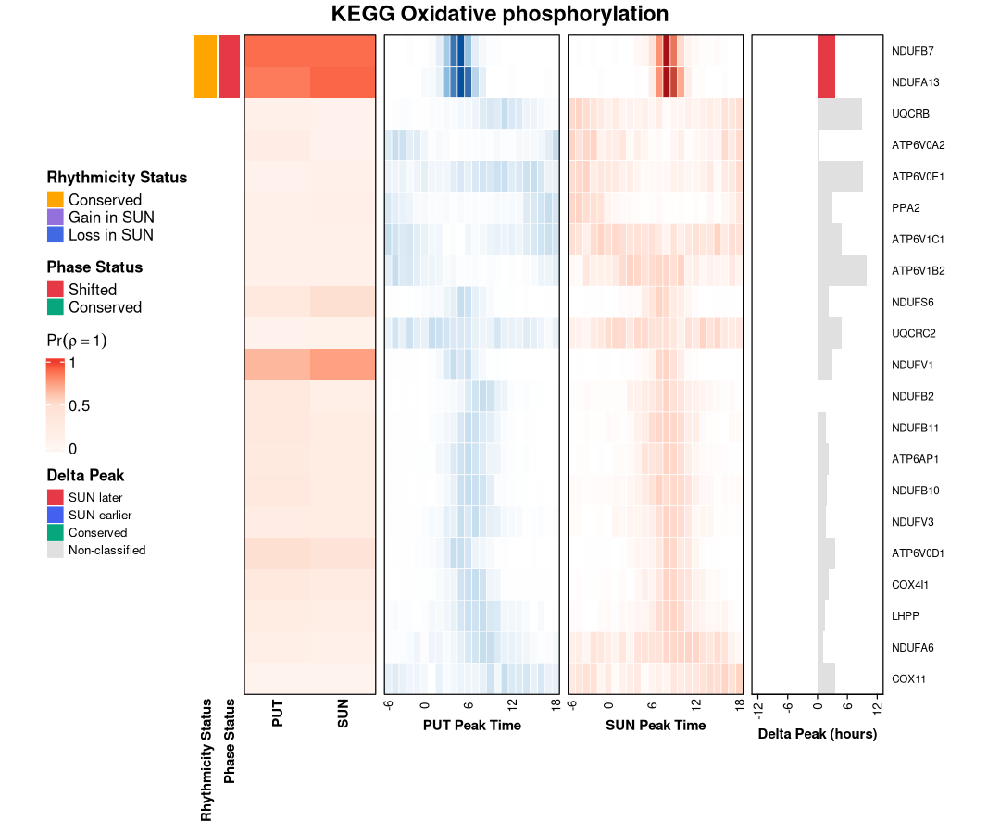

> **Audience:** biologists with RNA-seq experience; no background in Bayesian
> statistics is assumed. For the full derivations, see the BayRC manuscript
> and its supplementary methods.

BayRC answers a question standard differential-expression tools do not:
**how has the circadian transcriptome been remodeled between two biological
conditions?** Which genes switched from oscillating to flat? Which gained a
24-hour rhythm they didn't have before? Among genes that kept oscillating in
both conditions, do they still peak at the same hour, or has the clock reset
for them? BayRC answers all three questions from one posterior sample,
carrying the same uncertainty estimate from the single gene, through pathway
enrichment, to a genome-wide summary score.

This vignette runs the complete five-step BayRC workflow on real data: a
small, hand-picked gene panel from the bundled baboon putamen (PUT) versus
substantia nigra (SUN) dataset (Mure *et al.* 2018), so every chunk below
executes in under a minute and the numbers you see are the actual output of
the code, not a transcript. The panel and chain length are chosen for speed,
not statistical power: see the note at the end of the next section, and
`README.md`'s Quick Start, for the full 5,066-gene analysis at the chain
length used in the manuscript.

# Data and Setup

BayRC needs two objects per condition:

- an expression matrix, genes by samples, log-scale (log2(FPKM + 1) here),
  with gene symbols as row names;
- a zeitgeber time vector, one value per sample column, in hours.

The package ships a real dataset built from GSE98965 (Mure *et al.* 2018,
*Science*): 5,066 genes, 12 zeitgeber timepoints (ZT0 to ZT22, every 2 hours)
in each of two baboon brain regions, putamen and substantia nigra.


``` r
library(BayRC)

baboon <- readRDS(system.file("extdata", "baboon_PUT_SUN_GSE98965.rds", package = "BayRC"))
kegg   <- readRDS(system.file("extdata", "kegg_pathway_list_hsa.rds",   package = "BayRC"))

dim(baboon$expr_PUT)
#> [1] 5066   12
baboon$zt
#>  [1]  0  2  4  6  8 10 12 14 16 18 20 22
```

## A fast gene panel for this vignette

Running RJMCMC on all 5,066 genes at a chain length long enough to fully
resolve each gene's posterior takes about 30 minutes per condition, too slow
for a document meant to build in well under a minute. Instead this vignette
runs on a hand-picked panel of 62 genes: the 22 genes of the KEGG Circadian
rhythm pathway present in this dataset (the core clock machinery), 20 genes
from KEGG Oxidative phosphorylation, and 20 background genes sampled at
random, all fixed in advance so the panel below is exactly reproducible.
Two of the oxidative-phosphorylation genes, `NDUFB7` and `NDUFA13`, are
included deliberately: at the manuscript's full chain length on the complete
5,066-gene set, these two clear the Bayesian FDR threshold for conservation
between PUT and SUN and both show a shifted peak time, so keeping them in a
small illustrative panel gives this vignette a real, non-trivial signal to
walk through end to end, instead of an all-flat toy example.


``` r
gene_panel <- c(
  "ATP6AP1", "ATP6V0A2", "ATP6V0D1", "ATP6V0E1", "ATP6V1B2", "ATP6V1C1",
  "BTRC", "CD99", "CLOCK", "COX11", "COX4I1", "CREB1", "CRY1", "CRY2",
  "CSE1L", "CSNK1D", "CSNK1E", "CUL1", "CUL4A", "DAD1", "DBP", "DEGS1",
  "DUSP7", "ENSPANG00000006856", "FBXL3", "FBXW11", "GPATCH4", "HIF1A",
  "IDI1", "LHPP", "LMBR1", "MPV17", "NDUFA13", "NDUFA6", "NDUFB10",
  "NDUFB11", "NDUFB2", "NDUFB7", "NDUFS6", "NDUFV1", "NDUFV3", "NFIL3",
  "NR1D1", "NR1D2", "PER1", "PER2", "PPA2", "PRKAA1", "PRKAB1", "PRKAB2",
  "PRKAG1", "PRKAG2", "RORA", "SLC39A7", "SMG7", "SOD1", "SSB", "TEX261",
  "UQCRB", "UQCRC2", "USP53", "VASP"
)
n_genes <- length(gene_panel)
idx <- match(gene_panel, baboon$gene_symbol)

expr_PUT <- baboon$expr_PUT[idx, ]; rownames(expr_PUT) <- gene_panel
expr_SUN <- baboon$expr_SUN[idx, ]; rownames(expr_SUN) <- gene_panel
```

> **Interpretation:** Nothing about the code below is specific to this
> panel; the same calls run unchanged on the full 5,066-gene matrix, only
> slower. If you are adapting this vignette to your own data, this is the
> section to replace: build `expr_PUT`/`expr_SUN`-style matrices (genes by
> samples, log-scale) and a zeitgeber time vector, and skip the panel
> subsetting entirely.

# Step 1: MCMC Inference

For each gene, BayRC fits a cosinor curve with a rhythmicity switch:

$$Y_g(t) = M_g + \rho_g \, A_g \cos\!\left(\tfrac{2\pi}{24}(t - \phi_g)\right) + \varepsilon_g$$

$M_g$ is the MESOR (the rhythm-adjusted mean), $A_g$ the amplitude, $\phi_g$
the acrophase (peak time), and $\rho_g \in \{0, 1\}$ an indicator of whether
the gene oscillates at all. Reversible-jump MCMC moves between the flat
($\rho_g = 0$) and rhythmic ($\rho_g = 1$) models within a single chain
(Green 1995), updating amplitude and phase with slice sampling (Neal 2003).
The output is not a single best-fit curve per gene but a full posterior
sample of $\rho$, $\phi$, $A$, and $M$, which is what lets every downstream
step (Bayes factors, transition calls, phase concordance, pathway
enrichment) carry uncertainty forward instead of conditioning on a point
estimate.


``` r
data_list_PUT <- list(data = as.data.frame(log2(expr_PUT + 1)),
                       time = baboon$zt, gname = gene_panel)
data_list_SUN <- list(data = as.data.frame(log2(expr_SUN + 1)),
                       time = baboon$zt, gname = gene_panel)

init_PUT <- CB_init_single(Data.list = data_list_PUT, P = 24)
mcmc_PUT <- CB_MCMC_single_rj_slice(
  Data.list = data_list_PUT, Init.value = init_PUT, P = 24,
  iteration = 3000, n.burn = 500, thin = 10,          # short chain: vignette speed only
  p_rhythmic = rep(0.2, n_genes),
  save.file  = tempfile(fileext = ".rds"),             # keep intermediate saves out of the repo
  save.file2 = tempfile(fileext = ".rds")
)

init_SUN <- CB_init_single(Data.list = data_list_SUN, P = 24)
mcmc_SUN <- CB_MCMC_single_rj_slice(
  Data.list = data_list_SUN, Init.value = init_SUN, P = 24,
  iteration = 3000, n.burn = 500, thin = 10,
  p_rhythmic = rep(0.2, n_genes),
  save.file  = tempfile(fileext = ".rds"),
  save.file2 = tempfile(fileext = ".rds")
)
```


``` r
dim(mcmc_PUT$rho)   # genes x stored posterior draws
#> [1]  62 251
```

> **Interpretation:** `iteration = 3000, n.burn = 500, thin = 10` on 62
> genes is a chain sized for this document to build in seconds; README's
> Quick Start runs `iteration = 2000, n.burn = 500` (default `thin = 20`) on
> the full 5,066 genes, which is why that version takes about 30 minutes
> per condition instead of seconds. A short chain and a small gene panel
> both reduce statistical power, so treat every number in this vignette as
> a demonstration of the mechanics, not a result to cite. `save.file`/
> `save.file2` point at temporary files here only so this document does not
> leave stray `.rds` files behind; in your own analysis, point them
> somewhere you actually want a crash-recovery checkpoint.

# Step 2: Posterior Summaries

## Annotate first

`match_symbols()` has to run once per condition, immediately after MCMC and
before anything downstream; it attaches gene symbols and a Bayes-factor-based
call to the `rho` matrix as R attributes that later functions read.


``` r
mcmc_PUT <- match_symbols(mcmc_PUT, BF = 3, p_rhythmic = 0.2)
mcmc_SUN <- match_symbols(mcmc_SUN, BF = 3, p_rhythmic = 0.2)
```

## Posterior probability of rhythmicity

`rowMeans()` on the `rho` matrix is the posterior probability that a gene
oscillates, P(rho = 1 | data): the fraction of retained MCMC draws in which
that gene was in the rhythmic state.


``` r
pA <- rowMeans(mcmc_PUT$rho)   # P(rhythmic | data), putamen
pB <- rowMeans(mcmc_SUN$rho)   # P(rhythmic | data), substantia nigra
```

## Bayes factor and per-condition detection

`summarize_bay()` turns the same posterior probability into a Bayes factor,
BF = posterior odds / prior odds, which is easier to compare against a fixed
evidence scale (BF > 3 moderate, > 10 strong, > 100 decisive).
`detect_rhy()` applies Bayesian FDR (BFDR) control independently in each
condition to decide which genes count as rhythmic, rather than using a fixed
BF cutoff for every dataset.


``` r
bf_PUT <- summarize_bay(mcmc_PUT$rho, BF = 3, p_rhythmic = 0.2)
head(bf_PUT[order(-bf_PUT$BayesF), c("RowAverage", "BayesF")], 5)
#>          RowAverage    BayesF
#> NDUFB7    0.8924303 33.185185
#> NDUFA13   0.8525896 23.135135
#> NDUFV1    0.6653386  7.952381
#> DBP       0.5179283  4.297521
#> ATP6V0D1  0.4980080  3.968254

detected <- detect_rhy(mcmc_PUT, mcmc_SUN, bfdr_alpha = 0.25)
c(rhythmic_PUT = detected$n_rhythmic_A, rhythmic_SUN = detected$n_rhythmic_B,
  n_total = detected$n_total)
#> rhythmic_PUT rhythmic_SUN      n_total 
#>            3            4           62
```

> **Interpretation:** BFDR control sorts genes from most to least confidently
> rhythmic, then asks: if everything above this point were called rhythmic,
> what fraction would be wrong on average? `bfdr_from_posterior()` picks the
> most permissive cutoff that keeps this expected error rate under
> `bfdr_alpha` (0.25, matching the manuscript). Because it depends on the
> shape of the whole posterior-probability distribution rather than a fixed
> threshold like BF > 3, the same alpha calls a different number of genes
> rhythmic in different datasets, and calibrates more reliably with more
> candidate genes to sort. `NDUFB7` and `NDUFA13`, seeded into this panel for
> exactly this reason, sit at the top of the PUT ranking with Bayes factors
> around 33 and 23.

## Amplitude, phase, and credible intervals

`CB_getAllEst()` extracts posterior point estimates and 95% credible
intervals for every parameter. It returns an unnamed list in the order
amplitude, phase, MESOR, sigma, so name it once before using `$`-access.
Because phase is measured on a 24-hour circle, its credible interval is a
circular highest-density interval (HDI): the shortest arc containing 95% of
the posterior phase draws, computed so that it correctly wraps through
ZT0/24 rather than treating 23:00 and 01:00 as 22 hours apart.


``` r
est_PUT <- CB_getAllEst(mcmc_PUT, burn = 20)
names(est_PUT) <- c("A", "phi", "M", "sigma")

est_PUT$phi[c("NDUFB7", "NDUFA13"), ]
#>          phi.Est phi.Lower phi.Upper RHYindex
#> NDUFB7  4.096321  1.380035  6.526892        1
#> NDUFA13 4.415670  1.304354  7.116004        1
est_PUT$A[c("NDUFB7", "NDUFA13"), ]
#>            A.Est   A.Lower  A.Upper RHYindex
#> NDUFB7  1.798924 0.5220203 2.609201        1
#> NDUFA13 1.242395 0.5368103 2.057635        1
```

The same shortest-arc logic is available directly through `circular_HDI()`
and `circular_median()`, which is what `CB_getAllEst()` calls internally:


``` r
hdi_NDUFB7 <- circular_HDI(mcmc_PUT$phi["NDUFB7", ], credMass = 0.95, P = 24)
c(lower = round(hdi_NDUFB7$lower, 2), upper = round(hdi_NDUFB7$upper, 2),
  median = round(circular_median(mcmc_PUT$phi["NDUFB7", ]), 2))
#> lower.phi upper.phi    median 
#>      1.41      6.53      4.16
```

> **Interpretation:** `NDUFB7`'s posterior peak time in putamen is ZT 4.1,
> with a 95% credible interval of roughly ZT 1.4 to ZT 6.5, a fairly tight
> window given only 12 samples per condition. A wide interval, or one that
> straddles ZT0/24 (as some genes' intervals do), would mean the peak time
> itself is poorly constrained even if the gene is confidently rhythmic;
> amplitude and phase uncertainty are separate questions from rhythmicity.

# Step 3: Transition Classification

`transition_classify()` takes the marginal rhythmicity probabilities from
each condition and computes three joint posterior probabilities: gained
rhythmicity, p_gain = (1 − pA) × pB; lost rhythmicity, p_loss = pA × (1 −
pB); and maintained rhythmicity, p_cons = pA × pB. Each of these three
vectors then gets its own BFDR threshold, the same rule used above but
applied to the transition probability rather than the raw rhythmicity
probability. This posterior gain/loss/conserved classification replaces the
older practice of intersecting fixed-cutoff gene lists across conditions
with a Venn diagram, a practice shown to overstate how much circadian
reprogramming has actually occurred (Pelikan *et al.* 2022).


``` r
trans <- transition_classify(pA, pB, bfdr_alpha = 0.25)
#> === Transition-level BFDR results ===
#> τ_gain = 1 | n_gain = 0 
#> τ_loss = 1 | n_loss = 0 
#> τ_cons = 0.774 | n_cons = 2
c(n_gain = trans$n_gain, n_loss = trans$n_loss, n_cons = trans$n_cons)
#> n_gain n_loss n_cons 
#>      0      0      2
names(trans$gain_loss_status)[trans$gain_loss_status == "Maintained"]
#> [1] "NDUFA13" "NDUFB7"
```

> **Interpretation:** `gain_loss_status` is the central annotation vector;
> every function past this point reads it. On this 62-gene panel at BFDR
> 0.25, nothing clears the gain or loss threshold, and only `NDUFB7` and
> `NDUFA13` clear the conservation threshold, the two genes seeded into the
> panel for that reason. That is expected here, not a bug: p_gain, p_loss,
> and p_cons are products of two marginal probabilities, so they run smaller
> and noisier than either marginal alone, and BFDR calibrates more weakly
> with only 62 candidate genes than with the full genome. The product
> formula also encodes an assumption worth stating plainly: it treats a
> gene's rhythmicity call in one condition as conditionally independent of
> its call in the other, given the data, reasonable for two independently
> profiled tissues, and the same assumption the manuscript uses throughout.

# Step 4: Phase Concordance

For genes classified as "Maintained," `phase_infer()` asks a second
question: does the gene peak at the same time of day in both conditions, or
has its phase shifted? It computes the posterior distribution of the
circular phase difference delta-phi = phi_PUT − phi_SUN, tests whether
abs(delta-phi) exceeds a tolerance (2 hours here, the manuscript's primary
threshold), and applies BFDR control separately to the shift and
conservation calls.


``` r
phase <- phase_infer(
  phi_matrix1 = mcmc_PUT$phi, phi_matrix2 = mcmc_SUN$phi,
  gain_loss_status = trans$gain_loss_status,
  shift = 2, P = 24, bfdr_alpha = 0.25, compute_hdi = TRUE
)
#> Computing phase metrics for maintained genes...
#> 
#> === PHASE INFERENCE SUMMARY ===
#> Maintained genes: 2 
#> BFDR α = 0.25  | shift threshold = 2 h
#> Significant phase-shifted genes: 2 
#> Significant phase-conserved genes: 0 
#> Undetermined genes: 0 
#> HDI computation: enabled

maintained <- names(trans$gain_loss_status)[trans$gain_loss_status == "Maintained"]
data.frame(
  gene = maintained,
  peak_PUT = round(phase$peak1[maintained], 2),
  peak_SUN = round(phase$peak2[maintained], 2),
  deltaPhi = round(phase$deltaPhi.Est[maintained], 2),
  shifted  = phase$flag_shift[maintained],
  conserved = phase$flag_cons[maintained]
)
#>            gene peak_PUT peak_SUN deltaPhi shifted conserved
#> NDUFA13 NDUFA13     4.43     7.88    -3.53    TRUE     FALSE
#> NDUFB7   NDUFB7     4.16     7.60    -3.47    TRUE     FALSE
```

> **Interpretation:** Both `NDUFB7` and `NDUFA13` peak roughly 3.5 hours
> later in substantia nigra than in putamen (`deltaPhi` is PUT minus SUN, so
> a negative value means SUN peaks later), and both clear the shift
> threshold; neither is phase-conserved. Oscillation is maintained for these
> two mitochondrial complex-I subunits, but the clock has reset for them
> between tissues, a small-scale echo of the manuscript's own SUN-PUT
> finding that mitochondrial and proteostasis genes staying rhythmic in both
> tissues show widespread phase shifts rather than tight phase agreement.

# Step 5A: Two-Stage Pathway Enrichment

## Stage 1: which pathways are circadian-active at all

`pathSelect()` ranks genes by a posterior metric and tests every pathway in
a gene-set collection for enrichment toward one end of that ranking, using
FGSEA (`nproc = 1` keeps this single-process, which is also what keeps this
step check-safe under R CMD check's core budget). With
`ranking.method = "union"`, the ranking metric rewards genes rhythmic in
*either* condition, which is what makes this stage a broad first pass:
pathways that show up here have some circadian signal worth following up on
in Stage 2, whether that signal is gain, loss, or conservation.


``` r
result_union <- pathSelect(
  mcmc.merge.list = list(A = mcmc_PUT, B = mcmc_SUN),
  pathway.list = kegg, dataset.names = c("PUT", "SUN"),
  ranking.method = "union", score_type = "pos",
  qvalue.cut = 0.20, nperm = 1000, nproc = 1, seed = 42
)
#> 
#> === FGSEA PATHWAY ANALYSIS ===
#> Comparing: PUT vs SUN 
#> Ranking method: union 
#> Test type: One-sided (gain only) 
#> Pathways: 298 of 354 
#> Genes: 62 
#> Permutations: 1000 
#> 
#> Calculating posterior probabilities...
#> Probabilistic rhythmic gene summary:
#>   Expected rhythmic in PUT : 12.4 
#>   Expected rhythmic in SUN : 11.6 
#>   Expected gain: 7.6 
#>   Expected loss: 8.4 
#>   Expected conserved: 4 
#>   Expected union: 20 
#> 
#> Ranking statistics:
#>   Range: [ 0.1854 , 8.7527 ]
#>   Interpretation: Fisher-like statistic (-2*log(prob))
#> 
#> Running fgsea...
#> 
  |                                                                            
  |                                                                      |   0%
  |                                                                            
  |===================================                                   |  50%
  |                                                                            
  |======================================================================| 100%
#> 
#> Adding custom metrics...
#> 
#> === RESULTS SUMMARY ===
#> Significant pathways (Q < 0.2 ): 2 
#> 
#> Top significant pathways:
#>   KEGG Oxidative phosphorylation: ES=0.706, NES=1.528, Q=0.0313
#>            Geometric_Mean_Union=0.3405
#>            Expected: Gain=2.7 (0.312), Loss=3.2 (0.360), Conserved=2.9 (0.328)
#>   KEGG Non-alcoholic fatty liver disease: ES=0.716, NES=1.535, Q=0.0313
#>            Geometric_Mean_Union=0.3293
#>            Expected: Gain=2.2 (0.308), Loss=2.3 (0.329), Conserved=2.6 (0.363)

active <- result_union$results$pathway[result_union$results$pval < 0.05]
active_pathway_list <- kegg[active]
result_union$results[order(result_union$results$pval),
                      c("pathway", "pval", "padj", "size")]
#>                                  pathway       pval       padj size
#> 1         KEGG Oxidative phosphorylation 0.01817381 0.03131594   21
#> 2 KEGG Non-alcoholic fatty liver disease 0.02087729 0.03131594   17
#> 3                  KEGG Circadian rhythm 0.85514486 0.85514486   22
```

> **Interpretation:** Two pathways clear an unadjusted p < 0.05 pre-screen:
> KEGG Oxidative phosphorylation and KEGG Non-alcoholic fatty liver disease
> (which shares most of its genes with oxidative phosphorylation). KEGG
> Circadian rhythm itself, despite contributing 22 of the 62 genes in this
> panel, is not significant (p = 0.86): the union score rewards genes with
> high posterior support in either tissue, and on this short chain most
> core-clock genes carry only modest support individually, so the set does
> not stand out even though it is biologically the most clock-relevant list
> here. Pathway membership in "the circadian pathway" does not by itself
> guarantee an enrichment signal, especially when per-gene evidence is weak.

## Stage 2: what kind of transition is each active pathway enriched for

Restricting to the pathways that passed Stage 1, three more `pathSelect()`
calls test whether each is specifically enriched for gain, loss, or
conserved rhythmicity.


``` r
result_gain <- pathSelect(mcmc.merge.list = list(A = mcmc_PUT, B = mcmc_SUN),
  pathway.list = active_pathway_list, dataset.names = c("PUT", "SUN"),
  ranking.method = "gain", score_type = "pos",
  qvalue.cut = 0.20, nperm = 1000, nproc = 1, seed = 42)
#> 
#> === FGSEA PATHWAY ANALYSIS ===
#> Comparing: PUT vs SUN 
#> Ranking method: gain 
#> Test type: One-sided (gain only) 
#> Pathways: 2 of 2 
#> Genes: 62 
#> Permutations: 1000 
#> 
#> Calculating posterior probabilities...
#> Probabilistic rhythmic gene summary:
#>   Expected rhythmic in PUT : 12.4 
#>   Expected rhythmic in SUN : 11.6 
#>   Expected gain: 7.6 
#>   Expected loss: 8.4 
#>   Expected conserved: 4 
#>   Expected union: 20 
#> 
#> Ranking statistics:
#>   Range: [ 0.0427 , 0.397 ]
#> 
#> Running fgsea...
#> Adding custom metrics...
#> 
#> === RESULTS SUMMARY ===
#> Significant pathways (Q < 0.2 ): 0

result_cons <- pathSelect(mcmc.merge.list = list(A = mcmc_PUT, B = mcmc_SUN),
  pathway.list = active_pathway_list, dataset.names = c("PUT", "SUN"),
  ranking.method = "conserved", score_type = "pos",
  qvalue.cut = 0.20, nperm = 1000, nproc = 1, seed = 42)
#> 
#> === FGSEA PATHWAY ANALYSIS ===
#> Comparing: PUT vs SUN 
#> Ranking method: conserved 
#> Test type: One-sided (gain only) 
#> Pathways: 2 of 2 
#> Genes: 62 
#> Permutations: 1000 
#> 
#> Calculating posterior probabilities...
#> Probabilistic rhythmic gene summary:
#>   Expected rhythmic in PUT : 12.4 
#>   Expected rhythmic in SUN : 11.6 
#>   Expected gain: 7.6 
#>   Expected loss: 8.4 
#>   Expected conserved: 4 
#>   Expected union: 20 
#> 
#> Ranking statistics:
#>   Range: [ 0.0031 , 0.7974 ]
#> 
#> Running fgsea...
#> 
  |                                                                            
  |                                                                      |   0%
  |                                                                            
  |======================================================================| 100%
#> 
#> Adding custom metrics...
#> 
#> === RESULTS SUMMARY ===
#> Significant pathways (Q < 0.2 ): 2 
#> 
#> Top significant pathways:
#>   KEGG Oxidative phosphorylation: ES=0.838, NES=1.344, Q=0.0280
#>            Geometric_Mean_Conserved=0.0410
#>            Expected: Gain=2.7 (0.312), Loss=3.2 (0.360), Conserved=2.9 (0.328)
#>   KEGG Non-alcoholic fatty liver disease: ES=0.839, NES=1.365, Q=0.0280
#>            Geometric_Mean_Conserved=0.0390
#>            Expected: Gain=2.2 (0.308), Loss=2.3 (0.329), Conserved=2.6 (0.363)

result_gain$results[, c("pathway", "Gain_Loss_Ratio_Arithmetic", "padj")]
#>                                  pathway Gain_Loss_Ratio_Arithmetic      padj
#> 1         KEGG Oxidative phosphorylation                  0.8676340 0.2627373
#> 2 KEGG Non-alcoholic fatty liver disease                  0.9381672 0.2627373
```

> **Gain-loss ratio (GLR):** `Gain_Loss_Ratio_Arithmetic` compares expected
> gains to expected losses within a pathway; GLR > 1 means the pathway
> gained more rhythmicity than it lost going from PUT to SUN, GLR < 1 the
> reverse. Both active pathways sit just under 1 (about 0.87 and 0.94), a
> mild loss-leaning signal, consistent with conservation being the stage
> that reaches significance (Q around 0.028 for both) while gain finds
> nothing: these two pathways show mitochondrial genes staying rhythmic in
> both tissues while shifting phase, not genes switching on or off.

# Step 5B: Genome-Wide Concordance

`multi_conservation()` collapses the whole comparison into one number: an
adjusted Jaccard concordance score (the "c-score"), related to the
transcriptomic congruence framework of Zong *et al.* (2023), centered at 0
under no more overlap than chance and approaching 1 under perfect agreement,
together with a permutation p-value and a bootstrap confidence interval.
`select.pathway.list = "global"` runs it over every gene in the input rather
than one pathway at a time.


``` r
global <- multi_conservation(
  mcmc.merge.list = list(A = mcmc_PUT, B = mcmc_SUN),
  dataset.names = c("PUT", "SUN"),
  select.pathway.list = "global",
  n_perm = 80, n_boot = 80,      # small here for speed; see README for n_perm/n_boot at manuscript scale
  use_cpp = TRUE, save_output = FALSE
)
#> 
#> === Processing pair 1 of 1 : PUT vs SUN ===
#> Analyzing pathway 1/1: Global

round(global[, c("PUT_vs_SUN_AdjustedConcordance", "PUT_vs_SUN_PValue",
                  "PUT_vs_SUN_CI_Lower_Adj", "PUT_vs_SUN_CI_Upper_Adj",
                  "PUT_vs_SUN_GainLossRatio")], 3)
#>   PUT_vs_SUN_AdjustedConcordance PUT_vs_SUN_PValue PUT_vs_SUN_CI_Lower_Adj
#> 1                           0.11             0.012                   0.047
#>   PUT_vs_SUN_CI_Upper_Adj PUT_vs_SUN_GainLossRatio
#> 1                   0.175                    0.909
```

> **Interpretation:** The adjusted concordance here is about 0.11 (95% CI
> roughly 0.05 to 0.17, p = 0.012). Do not read this as an estimate of
> genome-wide PUT-SUN concordance: this panel was deliberately built around
> core clock genes and a mitochondrial pathway with two known real hits, not
> a random sample of the transcriptome, so its concordance runs biased
> upward relative to the full 5,066-gene comparison. Treat this number as
> confirmation the function runs correctly end to end, and compare it
> against README's Quick Start for the equivalent score on the full,
> unbiased gene set. As a general reading guide: a c-score above roughly 0.3
> with a small p-value indicates strong transcriptome-wide conservation, 0.1
> to 0.2 indicates modest but real conservation, and a score near 0 with p
> not significant indicates two largely independent circadian programs.

# The Five-Panel Pathway Heatmap

`plot_heatmap()` is BayRC's main visualization: one figure per pathway,
combining rhythmicity, transition status, and phase timing for every gene
in the pathway into five panels read left to right. It draws directly to
the current graphics device (nothing extra to save unless you pass
`save_path`), building on the output of `transition_classify()` and
`phase_infer()` above.


``` r
plot_heatmap(
  data1 = mcmc_PUT, data2 = mcmc_SUN,
  pathway_genes = kegg[["KEGG Oxidative phosphorylation"]],
  pathway_name  = "KEGG Oxidative phosphorylation",
  phase_results = phase, transition_results = trans,
  group_names = c("PUT", "SUN")
)
#> 
#> Pathway: KEGG Oxidative phosphorylation 
#> Genes: 21 
#>   [full] Using all 21 genes
```



```
#> 
#> === SUMMARY [ FULL ] ===
#> Total genes:     21 
#> Phase Shifted:   2 
#> Phase Conserved: 0 
#> Gain in SUN : 0 
#> Loss in SUN : 0
```

| Panel | Shows | How to read it |
|---|---|---|
| 1. Rhythmicity status | Transition type from `transition_classify()` | Orange = conserved rhythm, blue = loss in SUN, purple = gain in SUN |
| 2. Phase status | Shift/conservation flag from `phase_infer()` | Green = peaks align within the tolerance, red = peak timing shifted |
| 3. P(rho = 1 \| data), PUT and SUN | Posterior rhythmicity probability per condition | White to red gradient, 0 to 1; deep red is confident rhythmicity, near-white is flat |
| 4. Phase posterior, PUT | Histogram of the MCMC phase samples for each gene | A sharp bar means a tightly constrained peak time; a spread-out bar means high phase uncertainty |
| 5. Phase posterior, SUN | Same reading as panel 4, other condition | Compare bar position against panel 4 to see the shift visually |

> **Interpretation:** With only 21 of the 46 KEGG Oxidative phosphorylation
> genes present in this panel, most rows show pale panel-3 colors and no
> panel-1/2 annotation: those genes did not clear the BFDR threshold at this
> chain length, so they are correctly left unclassified rather than forced
> into a category. `NDUFB7` and `NDUFA13` are the two rows with a filled
> "Conserved" (panel 1) and "Shifted" (panel 2) annotation, and their
> panel-4/5 phase histograms sit visibly apart, PUT earlier, SUN later,
> matching the roughly 3.5-hour shift reported above. That contrast, a
> couple of confidently classified genes among many pale, unclassified ones,
> is what a real pathway heatmap looks like at limited statistical power; a
> longer chain on the full gene set fills in more rows, as in the
> manuscript's own figures.

# Biological Interpretation Checklist

Working through a BayRC result on your own data, these are the questions
worth asking in order:

- [ ] **Rhythmicity landscape.** What fraction of genes is rhythmic in each
  condition (`detect_rhy()`'s `n_rhythmic_A`/`n_rhythmic_B` relative to
  `n_total`)? A large asymmetry between conditions suggests broad circadian
  dampening or activation, not just a handful of genes moving.

- [ ] **Dominant transition.** Compare `trans$n_gain` against `trans$n_loss`.
  Loss-dominant is a signature commonly seen in aging and
  neurodegeneration; gain-dominant suggests the clock recruiting new
  transcriptional targets in the second condition.

- [ ] **Phase shifts among maintained genes.** For genes with
  `flag_shift = TRUE`, is `deltaPhi.Est` similar in size and direction
  across genes (pointing to one global clock advance or delay), or
  scattered (pointing to gene-specific regulatory rewiring rather than a
  single shifted oscillator)?

- [ ] **Pathway direction.** For each pathway that passes Stage 1, is Stage
  2 significant for gain, loss, or conserved rhythmicity, and is
  `Gain_Loss_Ratio_Arithmetic` above or below 1? A pathway can pass Stage 1
  for entirely different biological reasons depending on which Stage 2
  category drives it.

- [ ] **Panel size versus BFDR power.** BFDR calibration needs a reasonably
  large candidate gene list to work well, as this vignette's own 62-gene
  panel illustrates: run classification and pathway enrichment on the full
  gene set before drawing conclusions from a filtered subset.

- [ ] **Global concordance in context.** Is the c-score's confidence
  interval bounded away from 0, and is the genome-wide GLR above or below
  1? Read both together: a significant but small c-score with a GLR near 1
  describes two circadian programs that overlap modestly and are drifting
  in neither direction on net.

# References

- Green PJ. Reversible jump Markov chain Monte Carlo computation and
  Bayesian model determination. *Biometrika*. 1995;82(4):711-732.
  [10.1093/biomet/82.4.711](https://doi.org/10.1093/biomet/82.4.711)
- Neal RM. Slice sampling. *Annals of Statistics*. 2003;31(3):705-767.
- Newton MA, Noueiry A, Sarkar D, Ahlquist P. Detecting differential gene
  expression with a semiparametric hierarchical mixture method.
  *Biostatistics*. 2004;5(2):155-176.
- Müller P, Parmigiani G, Rice K. FDR and Bayesian multiple comparisons
  rules. *Bayesian Statistics 8*. 2007:349-370.
- Scott JG, Berger JO. Bayes and empirical-Bayes multiplicity adjustment in
  the variable-selection problem. *Annals of Statistics*.
  2010;38(5):2587-2619.
- Stephens M. False discovery rates: a new deal. *Biostatistics*.
  2016;18(2):275-294.
- Partch CL, Green CB, Takahashi JS. Molecular architecture of the
  mammalian circadian clock. *Trends in Cell Biology*. 2014;24(2):90-99.
- Mure LS, Le HD, Benegiamo G, et al. Diurnal transcriptome atlas of a
  primate across major neural and peripheral tissues. *Science*.
  2018;359(6381):eaao0318.
  [10.1126/science.aao0318](https://doi.org/10.1126/science.aao0318)
- Zong W, Rahman T, Zhu L, et al. Transcriptomic congruence analysis for
  evaluating model organisms. *PNAS*. 2023;120(6):e2202584120.
  [10.1073/pnas.2202584120](https://doi.org/10.1073/pnas.2202584120)
- Pelikan A, Herzel H, Kramer A, Ananthasubramaniam B. Venn diagram
  analysis overestimates the extent of circadian rhythm reprogramming.
  *FEBS Journal*. 2022;289(21):6605-6621.
  [10.1111/febs.16095](https://doi.org/10.1111/febs.16095)
