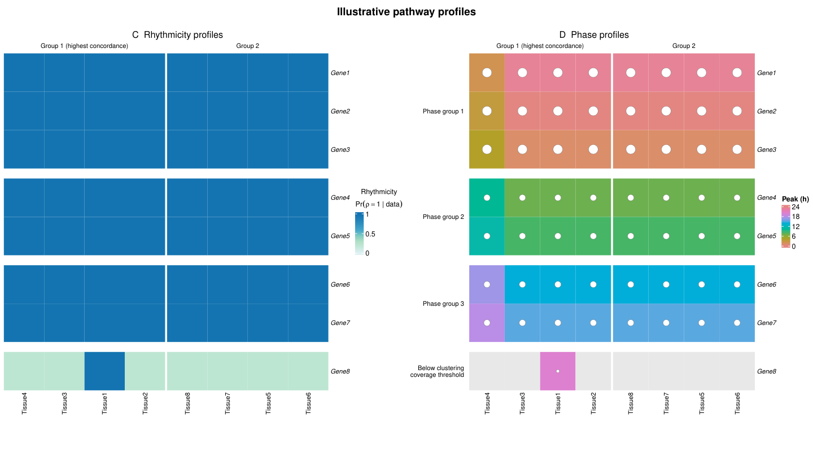

# Pathway rhythmicity and phase profiles

`plot_pathway_profiles()` draws paired rhythmicity and phase profiles for a
selected pathway across tissues, corresponding to the views in Figure 6C/D.
The package plot uses a shared row and column order. The manuscript retains
its original display style; the function provides a reusable implementation.

## Prepare the inputs

Supply one row per gene and tissue, using a common gene identifier and time
reference. Restrict to the pathway only after computing rhythmicity calls
across the full tested gene set in each tissue.

| Column | Meaning |
|---|---|
| `gene`, `tissue` | Gene and tissue identifiers |
| `posterior` | Posterior probability `Pr(rho = 1 | data)`, between zero and one |
| `called` | Logical tissue-specific rhythmicity call, for example at BFDR 0.25 |
| `peak` | Circular mean of posterior phase samples, in hours |
| `resultant` | Posterior mean resultant length, between zero and one |
| `interval_width` | Optional circular credible-interval arc length in hours, used for the white discs |

For posterior phase samples `phi` and period 24, obtain the circular summary as:

```r
z <- mean(exp(1i * 2 * pi * phi / 24))
peak <- (Arg(z) * 24 / (2 * pi)) %% 24
resultant <- Mod(z)
```

Use `circular_HDI()` for interval bounds, accounting for wrapping when computing
arc width. Interval width controls disc area; clustering uses the posterior
resultant length. A width alone does not determine that length.

Also supply a symmetric pathway rhythmic-concordance matrix named by tissue,
with entries in [-1, 1]. Compute this from rhythmicity inference, independently
of phase profiles; it is not a correlation matrix of peak times.

## Draw and inspect the profiles

```r
profiles <- plot_pathway_profiles(
  data = phase_summary,
  pathway_genes = pathway_genes,
  tissues = tissues,
  concordance = pathway_concordance,
  pathway_name = "Circadian pathway profiles",
  tissue_k = 2,
  gene_k = 3,
  min_gene_fraction = 0.5,
  file = "pathway_profiles.pdf"
)
profiles$tissue_groups
profiles$selected_tissues
profiles$phase_status
if (!is.null(profiles$hierarchy)) profiles$hierarchy$gene_groups
```

Panel C shows posterior rhythmicity probabilities on a zero-to-one scale.
Panel D shows peak times for called rhythmic genes; gray cells are not called
rhythmic. Larger white discs indicate wider phase intervals. Phase-group and
coverage labels appear only beside D, with the same gene order retained in C.
Use `draw = FALSE` to inspect clustering without creating a plot.

## How grouping works

1. Cluster tissues from `1 - concordance`, using Ward D2 linkage by default.
   `tissue_k` specifies the number of groups; the memberships are learned.
2. Select the nonsingleton group with the highest mean within-group concordance.
   This is a descriptive choice, not a test that its tissues are outliers.
3. Retain genes meeting `ceiling(min_gene_fraction * block_size)` rhythmic calls
   in **every** tissue group. Cluster their phase profiles across all supplied
   tissues, giving each tissue group equal weight. `gene_k` specifies the cut;
   this wrapper does not automatically choose it by silhouette score.
4. Within the selected tissue group, cluster tissues by phase, first averaging
   dissimilarities within each learned gene group, then equally across groups.
   Membership in the rhythmic tissue groups stays fixed.

Phase dissimilarity is `1 - R1 * R2 * cos(2*pi*(peak1-peak2)/24)`.
This is expected circular cosine loss under independent marginal phase
posteriors. Precisely estimated nearby peaks give low dissimilarity, opposite
peaks give high dissimilarity, and diffuse posteriors approach neutral loss 1.
Gene and phase-based tissue trees use average linkage. Ward D2 is used only for
the initial rhythmic-concordance tree; a variance-minimization interpretation
requires Euclidean distances.

For groups of nine and sixteen tissues, a 50% coverage setting requires five
and eight calls, respectively. Changing `tissue_k` also changes the blocks in
which coverage is checked. Genes below the threshold remain visible by default
but do not receive a learned phase-group label. Set `show_limited = FALSE` to
hide them; they are not an additional phase group.

## Sparse pathways

The default `sparse_method = "strict"` requires sufficient pairwise overlap.
With `sparse_method = "shrink"`, each block dissimilarity `d` is replaced by
`1 + n/(n + shrink_strength) * (d - 1)`, with default strength 2 and neutral loss
1 when there is no overlap. This exploratory regularization avoids stopping the
whole tree because one pair has little support; it does not establish missing
phase relationships. Coverage thresholds still apply.

```r
sparse_profiles <- plot_pathway_profiles(
  phase_summary, pathway_genes, tissues, pathway_concordance,
  tissue_k = 3, gene_k = 3, min_gene_fraction = 0.25,
  sparse_method = "shrink", shrink_strength = 2, draw = FALSE
)
```

If fewer than two genes qualify, or phase information cannot support a tree,
the panels remain available with `hierarchy = NULL` and an explanation in
`phase_status`. The function does not invent phase groups. The shrink option
caps the requested gene-group count at the eligible gene count.

## Runnable example



The [example script](../inst/analysis/readme_figures/plot_pathway_profiles_demo.R)
creates a small synthetic pathway and writes both panels without requiring
external datasets. Its supplied probabilities, calls and concordance values
illustrate the interface; they are not fitted biological results.

```sh
Rscript inst/analysis/readme_figures/plot_pathway_profiles_demo.R pathway_profiles_demo.pdf
```

For explicit tissue blocks and coverage counts, use
`pathway_phase_hierarchy()` directly. `plot_pathway_phase_hierarchy()` displays
its gene and tissue dendrograms with phase profiles, corresponding to the
supplementary clustering illustration. See `?pathway_phase_hierarchy`,
`?plot_pathway_phase_hierarchy` and `?plot_pathway_profiles` for all arguments.
